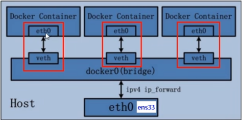

| 网络模式   | 说明                                                                                                                       |
| ---------- | -------------------------------------------------------------------------------------------------------------------------- |
| Host       | 容器将不会虚拟出自己的网卡，配置自己的IP等，而是使用宿主机的IP和端口                                                       |
| Bridge     | 此模式会为每一个容器分配、设置IP等，并将容器连接到一个docker0虚拟网桥，通过docker0网桥以及Iptables nat表配置与宿主机通信。 |
| None       | 该模式关闭了容器的网络功能。容器有独立的 `network namespace`, 但并没有对其进行任何网络设置                               |
| Container  | 创建的容器不会创建自己的网卡，配置自己的IP，而是和一个指定的容器共享IP、端口范围。                                         |
| 自定义网络 | 略                                                                                                                         |

#### 1. 默认网络

> * 安装docker时, 会默认创建3个网络, `brige`, `host`, `none`, 可以使用命令 ``docker network ls``查看
> * 运行容器时, 可以使用 `--network`来制定容器连接到哪个网络
> * bridge网络代表docker0所有Docker安装中存在的网络。除非你使用该 `docker run --network=选项` 指定，否则Docker守护程序默认将容器连接到此网络。
>   * host模式：使用 `--network=host` 指定。
>   * none模式：使用 `--network=none` 指定。默认使用docker0
>   * bridge模式：使用 `--network=bridge` 指定，默认设置。
>   * container模式：使用 `--network=container:NAME_or_ID` 指定。

##### 1.1 Host模式

> - 与宿主机在同一个网络中，但没有独立IP地址
> - Docker使用了Linux的Namespaces技术来进行资源隔离，如PID Namespace隔离进程，Mount Namespace隔离文件系统，Network Namespace隔离网络等
> - 一个Network Namespace提供了一份独立的网络环境，包括网卡、路由、Iptable规则等都与其他的Network Namespace隔离
> - 一个Docker容器一般会分配一个独立的Network Namespace
> - 但如果启动容器的时候使用host模式，那么这个容器将不会获得一个独立的Network Namespace，而是和宿主机共用一个Network Namespace。容器将不会虚拟出自己的网卡，配置自己的IP等，而是使用宿主机的IP和端口。

##### 1.2 Container模式

> - 这个模式指定新创建的容器和已经存在的一个容器共享一个Network Namespace，而不是和宿主机共享
> - 新创建的容器不会创建自己的网卡，配置自己的IP，而是和一个指定的容器共享IP、端口范围等

##### 1.3 None模式

> - 该模式将容器放置在它自己的网络栈中，但是并不进行任何配置
> - 实际上，该模式关闭了容器的网络功能，在以下两种情况下是有用的
>   - 容器并不需要网络（例如只需要写磁盘卷的批处理任务）
>   - overlay

##### 1.4 Bridge模式

> - 容器使用独立network Namespace，并连接到docker0虚拟网卡（默认模式）
> - 通过docker0网桥以及Iptables nat表配置与宿主机通信
> - bridge模式是Docker默认的网络设置
> - 此模式会为每一个容器分配Network Namespace、设置IP等，并将一个主机上的Docker容器连接到一个虚拟网桥上

#### 2. Bridge网络模式详解

##### 2.1 网络拓扑

> 
>
> - Docker server启动时，会在主机上创建一个名为docker0的虚拟网桥(其上有一个docker0内部接口), 此主机上启动的Docker容器会连接到这个虚拟网桥上
> - docker0在内核层联通了其他的武力或虚拟网卡, 这就将所有容器和本地机器都放在了一个物理网络
> - docker默认指定了docker0接口的ip地址和子网掩码, 让主机和容器之间可以通过网桥相互通信
> - 连接到docker0的容器就从这个子网中选择一个未占用的IP使用
> - 如一般Docker会使用172.17.0.0/16这个网段，并将172.17.0.1/16分配给docker0网桥（在主机上使用 `ifconfig`命令是可以看到docker0的，可以认为它是网桥的管理接口，在宿主机上作为一块虚拟网卡使用）

#### **. 常用命令

> | 命令                  | 说明                                                       |
> | --------------------- | ---------------------------------------------------------- |
> | `docker network ls` | 查看docker网络, 更多参考 `docker network --help`查看文档 |
> |                       |                                                            |
