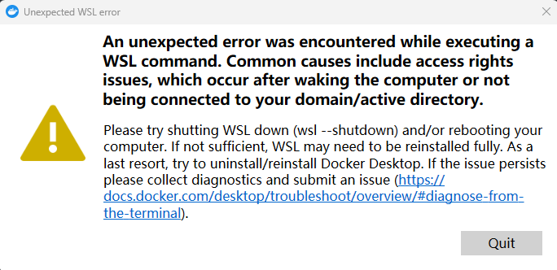

#### 1. 安装

略.  如果需要启用wsl, 请先看 [wsl](../../wsl/1.wsl.md)

#### **. 可能遇到的问题

##### **.1 启动失败, An unexpected error was encountered while executing a WSL command. Common causes include access rights issues, which occur after waking the computer or not being connected to your domain/active directory.

> 
>
> 解决办法, 启动wsl子系统, 如果子系统启动失败, 则输入 `netsh winsock reset`, 可以参考[wsl](../../wsl/1.wsl.md)的  **参考的对象类型不支持尝试的操作**
