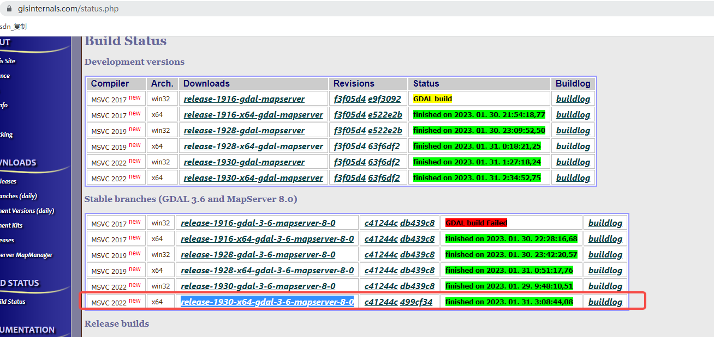
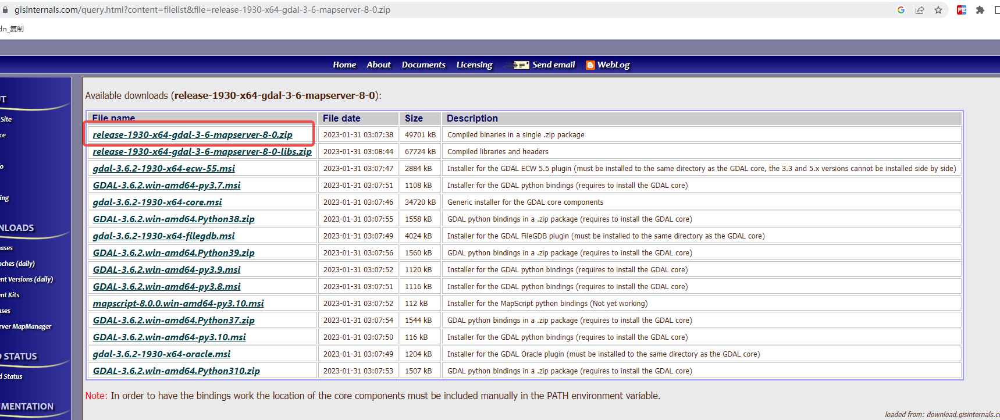
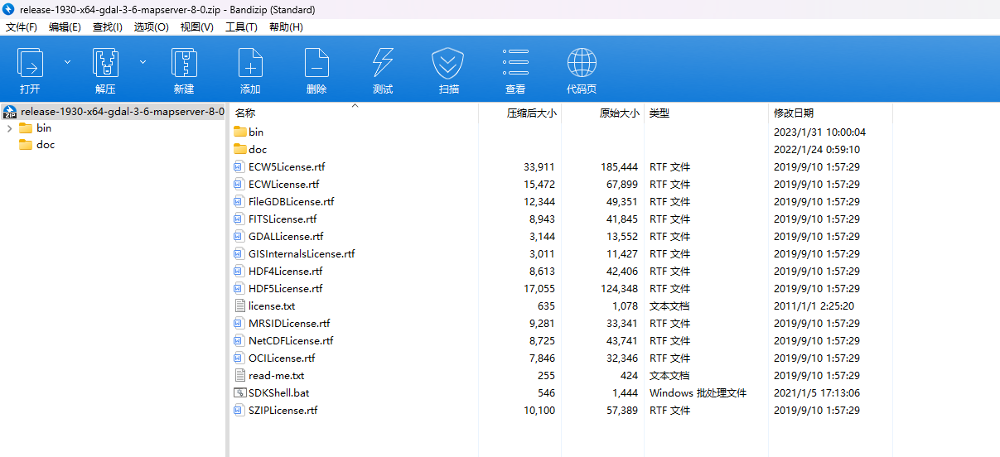
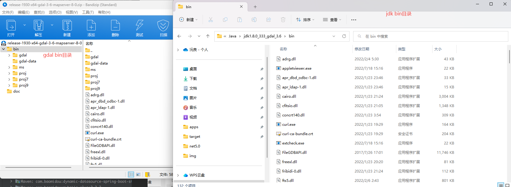

### windows

#### 1. 下载文件

- [下载地址](https://www.gisinternals.com/status.php)
- 这里以 `release-1930-x64-gdal-3-6-mapserver-8-0`为例, (`<font color="red">`注: 以下描述中以**XXXX**表示 `release-1930-x64-gdal-3-6-mapserver-8-0</font>`)
  
  

#### 2. 解压



#### 3. 拷贝dll文件

- 将 `XXXX\bin`目录下所有dll文件拷贝至项目所用jdk的bin目录下
- 

#### 4. 拷贝 `gdalalljni.dll`和 `gdal.jar`

- 4.1 `gdalalljni.dll`
  - 将 `XXXX\bin\gdal\java`路径下 `gdalalljni.dll`拷贝至项目根路径(或者拷贝至jdk的bin目录) (目前task-service根路径下已放置了3.6的gdalalljni.dll)
    - 如果项目启动报错(提示java.library.path路径下未找到gdalalljni, 将文件拷贝至jdk的bin目录即可)
- 4.2 `gdal.jar`导入项目
  - 方式一: 将 `XXXX\bin\gdal\java`路径下 `gdal.jar`手动添加至项目 (目前task-service根路径下已放置了3.6的gdal.jar), 但不推荐使用这种方式
  - 方式二: 使用maven导入, (建议), 此处版本要和gdal版本一致, 比如下载的3.6的zip包, maven需引入3.6.0的jar(目前docker容器是用的3.6版本的gdal, 所以就用这个版本吧)

  ```xml
  <dependency>
    <groupId>org.gdal</groupId>
    <artifactId>gdal</artifactId>
    <version>3.6.0</version>
    </dependency>
  ```

#### 5. 测试代码

```java
public class GdalTest {
  @Test
  public void testGdalJava() {
    gdal.AllRegister();
  }
}
```
