#### 0.常用命令

| 命令                                                                     | 说明                            |
| ------------------------------------------------------------------------ | ------------------------------- |
| wsl -l -v                                                                | 查看wsl安装哪些分支             |
| wsl --shutdown                                                           | 关闭所有的分支及wsl2            |
| wsl --export Ubuntu D:\fileSave\wsl\temp\ubuntu.tar                      | 导出相关分支                    |
| wsl --unregister Ubuntu                                                  | 注销分发并删除根文件系统。      |
| wsl --import Ubuntu D:\fileSave\wsl\wsl2 D:\fileSave\wsl\temp\ubuntu.tar | 将指定的 tar 文件作为新分发导入 |
| wsl --set-default-version 2                                              | 设置WSL 默认版本                |

| 命令                                   | 说明 |
| -------------------------------------- | ---- |
| bcdedit /set hypervisorlaunchtype auto |      |
| bcdedit /set hypervisorlaunchtype off  |      |

#### 1. 简介

> 适用于 Linux 的 Windows 子系统可让开发人员按原样运行 GNU/Linux 环境 - 包括大多数命令行工具、实用工具和应用程序 - 且不会产生传统虚拟机或双启动设置开销。

#### 2.准备工作

##### 2.1 电脑设置

###### 2.1.1 虚拟化设置

> - 首先确保虚拟化选项开启(新电脑一般好像都是默认打开的)。这个如果没有开启的话，需要进电脑的BIOS设置里开启 (设置方法谷歌/百度一下)
>
> 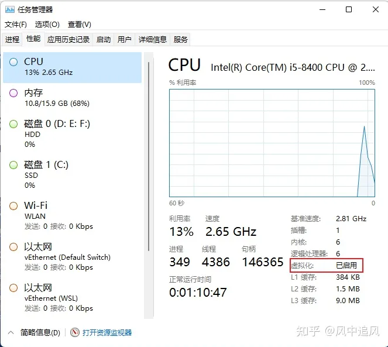

##### 2.2 系统设置(必须)

以下说明按照windows专业版说明

> - 勾选 `Hyper-v`
>
> 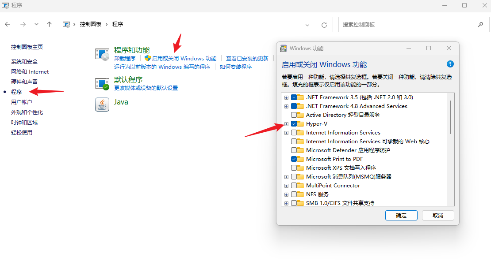
>
> - 勾选 `适用于Linux的Windows子系统`
>
> 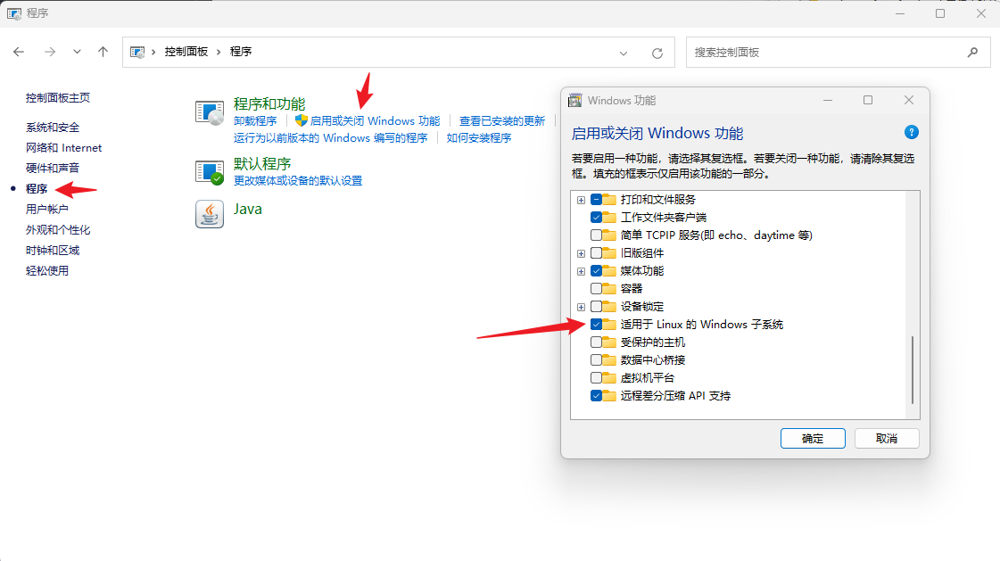
>
> - 打开 `Hyper-v` (管理员运行powershell)
>
> ```powershell
> bcdedit /set hypervisorlaunchtype auto #特别说明, 如果需要关闭, 则输入  bcdedit /set hypervisorlaunchtype off
> ```

#### 3.系统安装

##### 3.1 升级wsl内核

> - [官方文档地址](https://learn.microsoft.com/en-us/windows/wsl/install-manual#step-4---download-the-linux-kernel-update-package) 其实就以下两步(官网还包括系统安装之类, 也可以看我这个后续步骤)
>   - 下载wsl2安装包 [官方下载地址](https://wslstorestorage.blob.core.windows.net/wslblob/wsl_update_x64.msi)
>   - 设置WSL 默认版本  `wsl --set-default-version 2`

##### 3.2 安装linux系统

> 有两种安装方式, 二选其一

###### 3.2.1 命令安装

> ```powershell
> wsl --install -d Ubuntu
> ```

###### 3.2.2 微软商店安装

> 你喜欢哪个下哪个, 例如 Ubuntu
>
> 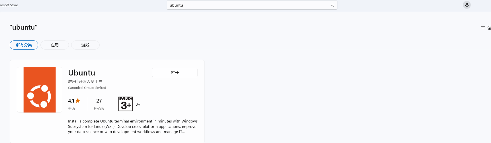
>
> 安装好以后, 点击*打开*即可,按照提示设置用户名及密码
>
> 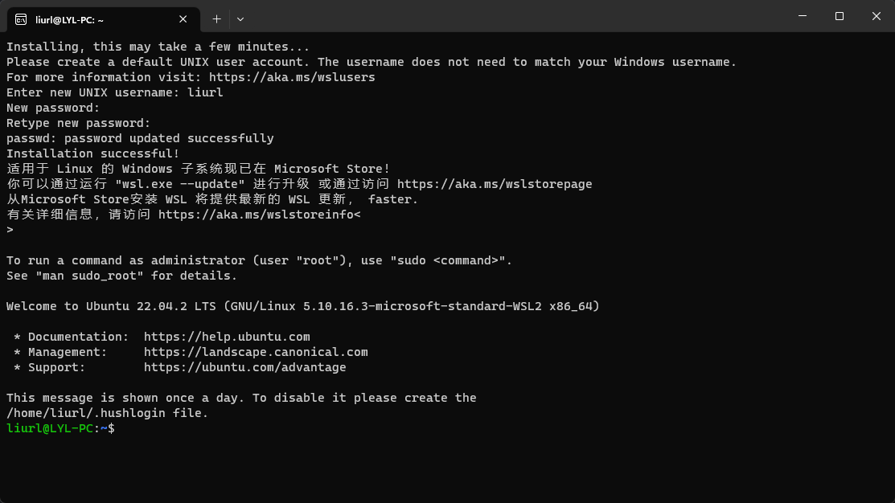

#### 4. 终端安装(可选)

> 推荐装一个终端软件
>
> 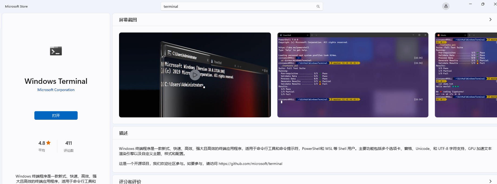

#### 5. 存储迁移(可选)

> - wsl默认保存在C:\Users\<主机名>\AppData\Local下, 如果需要迁移存储位置, 可按照以下方式进行处理
>   ```powershell
>   #1.查看wsl安装哪些分支
>   wsl -l -v
>   #2.关闭所有的分支及wsl2
>   wsl --shutdown
>   #3.导出相关分支
>   wsl --export Ubuntu D:\fileSave\wsl\temp\ubuntu.tar
>   #4.注销分发并删除根文件系统。
>   wsl --unregister Ubuntu
>   #5.将指定的 tar 文件作为新分发导入
>   wsl --import Ubuntu D:\fileSave\wsl\wsl2 D:\fileSave\wsl\temp\ubuntu.tar
>   #6.查看。执行1的操作即可。
>   ```
>
> (特备说明: 以上步骤也可以用来迁移docker存储位置, 详见[1.docker-desktop相关记录](../docker/docker-desktop%E7%9B%B8%E5%85%B3%E8%AF%B4%E6%98%8E/1.docker-desktop%E7%9B%B8%E5%85%B3%E8%AE%B0%E5%BD%95.md))
>
> - 执行样例如下 `<br/>`
>   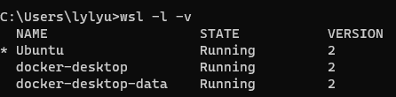
>   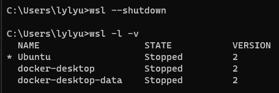
>   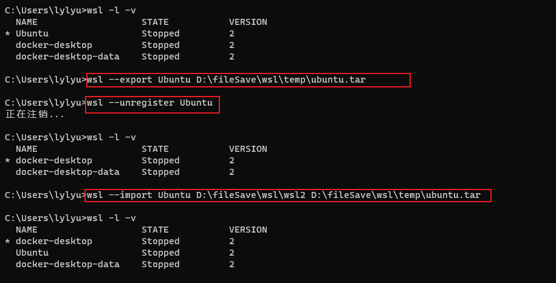

#### **. 可能遇到的问题

##### **.1 Ubuntu启动报错

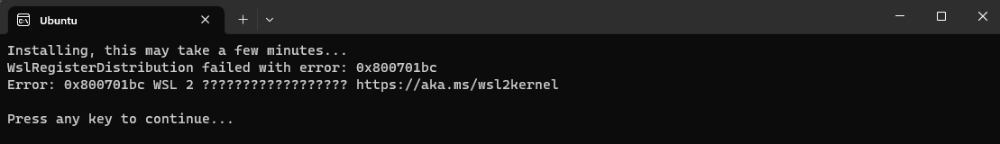

解决办法, 升级wsl内核, 见 `3.1`

##### **.2 安装Ubuntu时提示系统找不到指定的文件。


解决办法:

> ```powershell
> ##1. 查询当前已安装的系统
> wsl.exe --list --all
>
> ##2. 注销当前注册的系统  
> wsl.exe --unregister Ubuntu20.04LTS ##第一步查询出来需要注销的系统名称
>
> ##3. 重启Ubuntu, 系统就会初始化
> ```
>
> 操作截图如下
>
> 
>
> 

##### **.3 参考的对象类型不支持尝试的操作

> 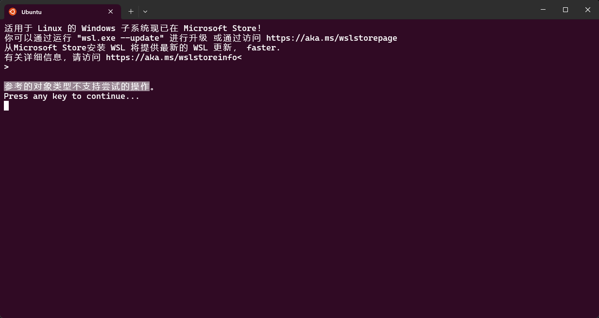
>
> 解决办法, 管理员打开cmd, 输入 `netsh winsock reset`, 然后重启子系统即可
