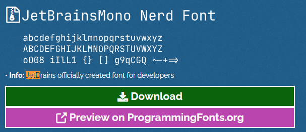
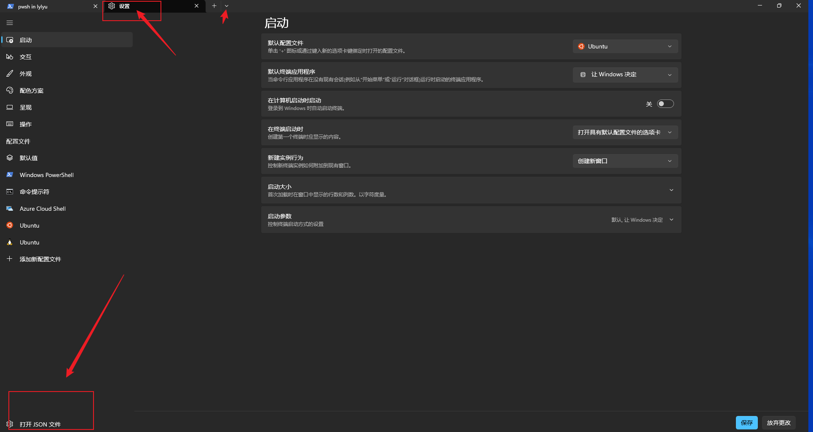

# 1 下载和安装

> 方式一:[ github地址](https://github.com/microsoft/terminal)
>
> 方式二: 微软商店搜索 `windows terminal`

# 2 美化Powershell(oh-my-posh)

详细教程可以看[参考教程](https://mdnice.com/writing/b8671c3d1e0c4c72ac98a54b64f067bc) , 以下只对本机命令安装做一个简单的记录

## 2.1 power shell执行策略修改

| 命令                          | 说明                                                                                                                                                                                                                                                                                                                                                                                                                                                                                               |
| ----------------------------- | -------------------------------------------------------------------------------------------------------------------------------------------------------------------------------------------------------------------------------------------------------------------------------------------------------------------------------------------------------------------------------------------------------------------------------------------------------------------------------------------------- |
| **get-ExecutionPolicy** | 获取 Windows PowerShell 当前执行策略                                                                                                                                                                                                                                                                                                                                                                                                                                                               |
| **set-ExecutionPolicy** | 修改 Windows PowerShell 中执行策略, 管理员运行<br />- **Restricted**,默认值, 表示状态是禁止的 不载入配置文件, 不执行脚本<br />- **RemoteSigned**,所有从互联网上下载的脚本必须通过信任的出版商签名<br />- **AllSigned**,所有的配置文件和脚本必须通过信任的出版商签名(trusted publisher)，这里所指的脚本页包括在本地计算机上创建的脚本<br />- **Unrestricted**, 载入所有的配置文件和脚本，如果运行了一个从互联网上下载且没有数字签名的脚本，在执行前都会被提示是否执行 |

> ```powershell
> # 获取 Windows PowerShell 当前执行策略
> get-ExecutionPolicy
>
> # 修改 Windows PowerShell 中执行策略
> set-ExecutionPolicy RemoteSigned
> ```

## 2.2 安装oh-my-posh

```powershell
# oh-my-posh 安装命令, --location表示安装目录
winget install JanDeDobbeleer.OhMyPosh -s winget --location D:\software\OhMyPosh

# oh-my-posh 更新命令,  --location表示安装目录
winget upgrade JanDeDobbeleer.OhMyPosh -s winget --location D:\software\OhMyPosh
```

## 2.3 创建powershell配置文件

```powershell
# 查看当前是否存在 PowerShell 配置文件
# False 不存在配置文件
# True  存在配置文件
Test-Path $PROFILE

# 如果Test-Path $PROFILE 返回False, 则执行下面的命令
# 创建一个 PowerShell 配置文件
New-Item -Path $PROFILE -Type File -Force
```

### 2.3.1 编辑配置文件

> 配置文件路径可以通过在 `powershell`终端输入 `$PROFILE`来查看

#### 2.3.1.1 添加快捷打开函数(可选)

```powershell
# Microsoft.PowerShell_profile.ps1

# 使用 vscode 打开 $PROFILE 配置文件,  
# 在powershell终端里面输入vscodeOpen , 即可快捷打开配置文件
function vscodeOpen {
 Code $PROFILE
}

# 使用 nodepad++ 打开 $PROFILE 配置文件
# 在powershell终端里面输入notepadOpen , 即可快捷打开配置文件
function notepadOpen {
 noetepad $PROFILE
}
```

#### 2.3.1.2 oh-my-posh 主题定制化配置

> [官网主题定制化说明](https://ohmyposh.dev/docs/installation/customize)

> [oh-my-posh 主题官网说明](https://ohmyposh.dev/docs/themes)

主要配置如下

```powershell
# $PROFILE 配置文件路径
# C:\Users\sunsb\Documents\WindowsPowerShell\Microsoft.PowerShell_profile.ps1

# 配置 oh-my-posh 主题方式一
# 所有的本地主题文件都在 D:/OhMyPosh/themes 目录下，以 .json 结尾
# oh-my-posh init pwsh --config 'D:/OhMyPosh/themes/jandedobbeleer.omp.json' | Invoke-Expression

# 配置 oh-my-posh 主题方式二，远程方式
# oh-my-posh init pwsh --config 'https://raw.githubusercontent.com/JanDeDobbeleer/oh-my-posh/main/themes/jandedobbeleer.omp.json' | Invoke-Expression

# 配置 oh-my-posh 主题方式三，当前我使用的
# POSH_THEMES_PATH 是 oh-m-posh 的 用户环境变量
oh-my-posh init pwsh --config "$env:POSH_THEMES_PATH/jandedobbeleer.omp.json" | Invoke-Expression

# 导出 oh-my-posh 主题
# oh-my-posh config export --output D:/jandedobbeleer.omp.json
```

### 2.3.2 安装字体

```powershell
# 执行以下命令后选择字体进行安装
oh-my-posh font install
```

或者打开官网地址下载安装 [https://www.nerdfonts.com/font-downloads](https://www.nerdfonts.com/font-downloads)



### 2.3.3 修改 windows terminal 配置文件



将 `2.3.2`中的字体配置到setting文件中

```json
{
 "profiles": {
  "defaults": {
   "experimental.retroTerminalEffect": false,
   "font": {
    "face": "JetBrainsMono Nerd Font",
    "size": 14
   }
  },
 }
}
```

`defaults`: 终端的默认值配置

`experimental.retroTerminalEffect`: 复古风格的终端效果

# 补充说明

## 说明1-windows环境变量

| 变量名                          | 变量说明                          |
| ------------------------------- | --------------------------------- |
| $HOME                           | 用户的主目录                      |
| $PSHOME                         | PowerShell 安装目录               |
| $PROFILE                        | 当前用户、当前主机 配置文件的路径 |
| $PROFILE.CurrentUserCurrentHost | 当前用户、当前主机 配置文件的路径 |
| $PROFILE.CurrentUserAllHosts    | 当前用户，所有主机 配置文件的路径 |
| $PROFILE.AllUsersCurrentHost    | 所有用户，当前主机 配置文件的路径 |
| $PROFILE.AllUsersAllHosts       | 所有用户、所有主机 配置文件的路径 |
