# 0 docker版搭建

> [官网说明](https://eco.dameng.com/community/post/202303141607039WA8KAWQYP1EG8WI7R)

> ```shell
> sudo docker run -d -p 5236:5236 \
> --name=dmserver \
> --restart=always \
> --privileged=true \
> -e CASE_SENSITIVE=0 \
> -e UNICODE_FLAG=1 \
> -e LENGTH_IN_CHAR=1 \
> -e LD_LIBRARY_PATH=/opt/dmdbms/bin \
> -v /mnt/d/fileSave/DM/data/dm8_01:/opt/dmdbms/data \
> dm8_single:v8.1.2.128_ent_x86_64_ctm_pack4
> ```

# 1 自增列无法insert(比如导入)

> 解决办法: 在insert语句前面加上
>
> ```sql
> set IDENTITY_INSERT 表名 on;
>
> ```
>
> 语法说明
> `SET IDENTITY_INSERT [ [ database_name . ] schema_name . ] table_name { ON | OFF }`

# 2 代码中insert id字段(自增列)

> 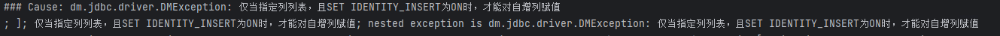
>
> 解决办法:
>
> tkmybatis: 使用下面的方法
>
>> 由数据库自增主键:
>>
>> ```java
>> entityDao.insertSelective(entity);
>> ```
>>
>> 自定义主键生成器:
>> `待补充`
>>
>
> mybatis-plus:
>
>> 数据库自增主键: 使用注解 @TableId(value = "id",type = IdType.AUTO)
>>
>> ```java
>> @Data
>> @TableName("custom_user")
>> @Builder
>> public class CustomUser {
>>     @TableId(value = "id",type = IdType.AUTO)
>>     private Long id;
>>     private String name;
>>     private Integer age;
>>     private String email;
>> }
>> ```
>>
>> 自定义主键插入(不依赖于数据库自增): 使用扩展  **SQL 自动注入器接口 `ISqlInjector`**, [完整参考代码](https://github.com/lylyuanliang/demos/blob/dev/db-mybatis-plus/src/main/java/com/example/injection/readme.md)
>>
>> ```java
>> /**
>>  * mybatis-plus扩展sql注入器-自增主键插入达梦
>>  */
>> public class InsertDmWithId extends AbstractMethod {
>>
>>     /**
>>      * 方法名, 这个方法名要和 com.example.injection.mapper.MyBaseMapper 中的方法名保持一致
>>      */
>>     private static final String METHOD_NAME = "insertDmWithId";
>>
>>     /**
>>      * 开启达梦自增主键插入功能,  %s表示表名
>>      */
>>     private static final String IDENTITY_INSERT_ON = "<script> set IDENTITY_INSERT %s on;";
>>
>>     public InsertDmWithId() {
>>         // 调用父类有参构造函数(无参构造函数已过期)
>>         super(METHOD_NAME);
>>     }
>>
>>     @Override
>>     public MappedStatement injectMappedStatement(Class<?> mapperClass, Class<?> modelClass, TableInfo tableInfo) {
>>         // 直接复用insert的sql, 需要先设置IDENTITY_INSERT on才能插入带id的sql
>>         String sql = IDENTITY_INSERT_ON + SqlMethod.INSERT_ONE.getSql().replace("<script>", "");
>>
>>
>>         String columnScript = SqlScriptUtils.convertTrim(tableInfo.getAllInsertSqlColumnMaybeIf(null),
>>                 LEFT_BRACKET, RIGHT_BRACKET, null, COMMA);
>>         String valuesScript = SqlScriptUtils.convertTrim(tableInfo.getAllInsertSqlPropertyMaybeIf(null),
>>                 LEFT_BRACKET, RIGHT_BRACKET, null, COMMA);
>>         String keyProperty = null;
>>         String keyColumn = null;
>>         KeyGenerator keyGenerator = NoKeyGenerator.INSTANCE;
>>         // 表包含主键处理逻辑,如果不包含主键当普通字段处理
>>         if (StringUtils.isNotBlank(tableInfo.getKeyProperty())) {
>>             if (tableInfo.getIdType() == IdType.AUTO) {
>>                 /* 自增主键 */
>>                 keyGenerator = Jdbc3KeyGenerator.INSTANCE;
>>                 keyProperty = tableInfo.getKeyProperty();
>>                 keyColumn = tableInfo.getKeyColumn();
>>             } else if (null != tableInfo.getKeySequence()) {
>>                 keyGenerator = TableInfoHelper.genKeyGenerator(this.methodName, tableInfo, builderAssistant);
>>                 keyProperty = tableInfo.getKeyProperty();
>>                 keyColumn = tableInfo.getKeyColumn();
>>             }
>>         }
>>         String tableName = tableInfo.getTableName();
>>         sql = String.format(sql, tableName, tableName, columnScript, valuesScript);
>>         SqlSource sqlSource = languageDriver.createSqlSource(configuration, sql, modelClass);
>>         return this.addInsertMappedStatement(mapperClass, modelClass, sqlSource, keyGenerator, keyProperty, keyColumn);
>>     }
>> }
>> ```
>>

# 3 pagehelper无法获取数据库类型

> 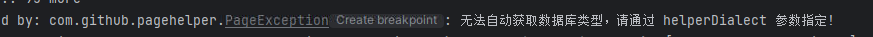
>
> 解决办法:
>
> 第一种：
>
>> 切换到达梦数据库下需要设置此参数，否则分页无效
>> PageHelper.helperDialect=oracle
>>
>> ```yml
>> # 可以在application.yml中直接增加如下配置
>> pagehelper:
>>   helperDialect: oracle
>> ```
>>
>
> 第二种：
>
>> PageHelper版本高点(至少5.1.4)就行，使用方法跟其他数据库一样的。gitee上有的[https://gitee.com/free/Mybatis_PageHelper](https://gitee.com/free/Mybatis_PageHelper)
>>
>> 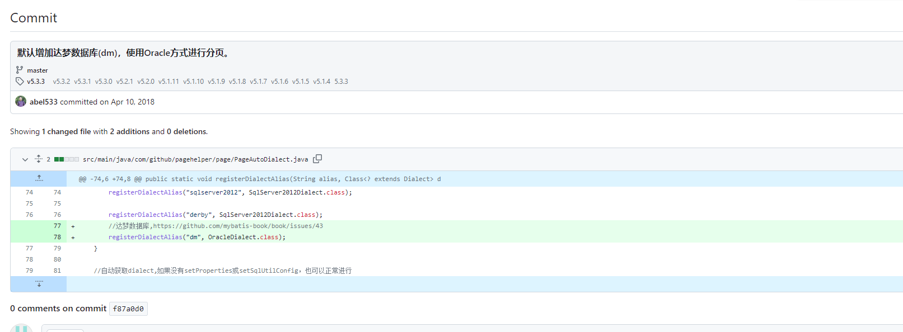
>>

# 4 函数部分对比

> [官方说明](https://eco.dameng.com/document/dm/zh-cn/pm/function.html)
>
> | 函数名        | 是否支持 | 其他说明                                                  |
> | ------------- | -------- | --------------------------------------------------------- |
> | CONCAT        | 支持     | 顺序联结多个字符串成为一个字符串                          |
> | from_unixtime | 支持     | from_unixtime(unixtime)<br />from_unixtime(unixtime, fmt) |
> | IF            | 支持     |                                                           |
> | json_extract  | 支持     | json_extract 获取 JSON 字符串中指定“名称”对应的“值”   |
> | date_format   | 支持     |                                                           |
> | now           | 支持     |                                                           |
> |               |          |                                                           |
> |               |          |                                                           |
> |               |          |                                                           |
> |               |          |                                                           |
> |               |          |                                                           |
> |               |          |                                                           |
> |               |          |                                                           |

# 5 case when执行结果不一致

> 解决办法:
>
> 办法一:
>
>> 因为我的逻辑是不为空时计算最大值, 原sql为
>>
>> ```sql
>> select case when id <> ' ' then max(id) else 0 end as id select xxx
>> ```
>>
>> 可能原因是在mysql中, `' '` 被隐藏转换成了0, 所以能查出结果, 但实际值只会有null和数字,  被因此换一种方式, 使用mysql和达梦都支持的函数 `ifnull `, 上述 `搜索case when `在表不为空时也可以改为 `简单case when `(`简单case when` 在表为空时返回null)
>>
>> ```sql
>> # IFNULL(n1,n2)	当 n1 为非空时，返回 n1；若 n1 为空，则返回 n2
>> # 还有另一个NULLIF, 但是nullif函数在表为空时返回null, 而ifnull在表为空时返回0
>> select ifnull(max(id), 0) as id from xxx
>> ```
>>
>> 对于 `' '`的对比结果
>>
>> 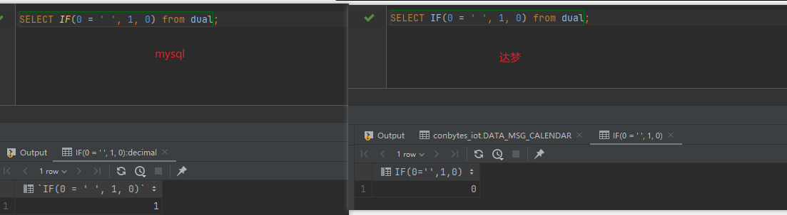
>>

# 6 日期匹配问题

## 6.1 格式 %y-%m-%d

> 原sql为
>
> ```sql
> select * from xxx where date=date_format(now(), '%y-%m-%d')
> ```
>
> 发现在达梦和mysql中的结果不一样, 原因是数据库存储的是 `YYYY-MM-DD`格式, `%y-%m-%d`在mysql中可以进行匹配, 但是达梦需要严格匹配, `%y`表示两位数的年,
>
> 解决办法
>
> `%y`改为 `%Y`,

## 6.2 不兼容的格式, yyyy-MM-dd'T'HH:mm:ss.SSS'Z'

> 问题描述:
>
>> ```sql
>> select * from custom_table where create_time > #{createTime}
>> ```
>>
>> #{createTime}由java代码处理, 传入的值为 `2023-08-02T08:51:33.879Z`,
>>
>> 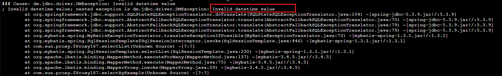
>>
>> 依赖
>>
>> ```xml
>> <dependency>
>>     <groupId>com.dameng</groupId>
>>     <artifactId>DmJdbcDriver18</artifactId>
>>     <version>8.1.2.192</version>
>> </dependency>
>> ```
>>
>
> 解决办法参考:  java格式化入参
>
>> ```java
>> private String formatTime(String dateString) {
>>     DateTimeFormatter formatter = DateTimeFormatter.ofPattern("yyyy-MM-dd'T'HH:mm:ss.SSS'Z'");
>>     LocalDateTime dateTime = LocalDateTime.parse(dateString, formatter);
>>   
>>     DateTimeFormatter formatter2 = DateTimeFormatter.ofPattern("yyyy-MM-dd HH:mm:ss");
>>     return dateTime.format(formatter2);
>> }
>> ```
>>
>
> **注1**: 同样以sql `select * from your_table where create_time > #{startTime} and create_time < #{endTime}`为例
>
>> 当 `startTime`和 `endTime`一样时, 达梦不会去校验语法问题, 是可以执行的(虽然咱们不会这样写,但还是做个记录)
>>
>> 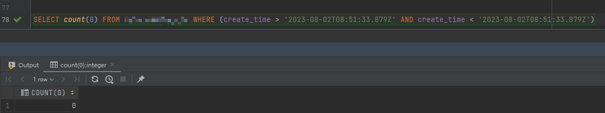
>>
>> 当 `startTime`和 `endTime`不一样时, sql就会报错了
>>
>> 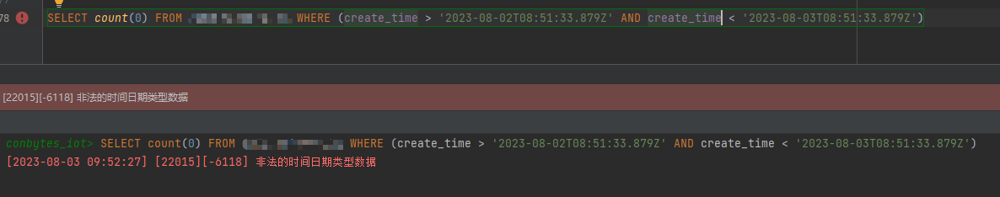
>>
>
> **注2**: 同样以sql `select * from your_table where create_time > #{startTime} and create_time < #{endTime}`为例
>
>> 当表里面没有数据时, 达梦也不会去校验sql语法
>>
>> 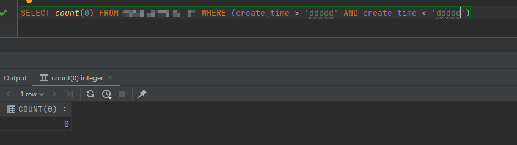
>>

# 7 关键字/保留字处理

> 情况一: mapper(自定义sql)
>
>> 写两套sql(达梦和mysql分开写)
>>
>> 例如mapper.xml
>>
>> 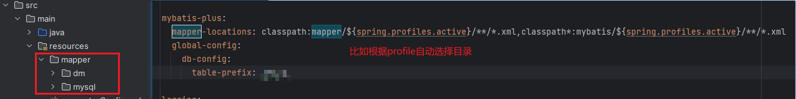
>>
>> 或者 实现 `org.springframework.context.annotation.Condition`, 来根据不同环境加载不同的bean, 例如
>>
>> 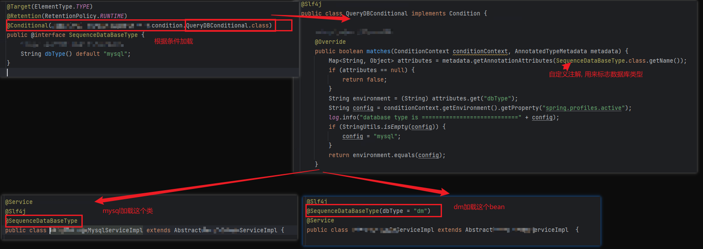
>>
>
> 情况二: 实体类(用框架内置方法框架内置方法进行增删查改)
>
>> tk-mybatis 解决办法:  保证mapper的依赖版本大于等于 3.5.0 (3.4.X不支持), 然后配置mapper.wrap-keyword, 样例如下
>>
>> ```xml
>> <dependency>
>>     <groupId>tk.mybatis</groupId>
>>     <artifactId>mapper</artifactId>
>>     <version>3.5.0</version>
>> </denpendcy>
>> ```
>>
>> 配置如下,
>>
>> ```yaml
>> # mysql配置wrap-keyword: '`{0}`', oracle和达梦配置wrap-keyword: '"{0}"', 请根据自己数据库的关键字转义符进行配置
>> # 对应实体类 tk.mybatis.mapper.entity.Config#wrapKeyword
>> mapper:
>>   wrap-keyword: '`{0}`'
>> ```
>>
>> mybatis-plus 解决办法: [配置说明地址](https://baomidou.com/pages/56bac0/#columnformat)
>>
>> 配置如下,
>>
>> ```yaml
>> # 对应的源码 com.baomidou.mybatisplus.core.config.GlobalConfig.DbConfig#columnFormat, 版本需要大于等于3.3.1
>> mybatis-plus:
>>   global-config:
>>     db-config:
>>      # mysql配置column-format: "`%s`", oracle和达梦配置column-format: "\"%s\"", 请根据自己数据库的关键字转义符进行配置
>>       column-format: "\"%s\""
>> ```
>>

# 8 MySQL ON UPDATE CURRENT_TIMESTAMP

> 达梦不支持这个, 可以使用触发器(更新时, update_time这类字段由数据库设置默认值)
>
> ```sql
> -- 以下脚本纯手打, 可能会有单词打错
> -- 给相应字段设置默认值 CURRENT_TIMESTAMP(3)
> alter table [schema].[表名] alter column ["更新时间"字段的名称] set default (CURRENT_TIMESTAMP(3));
>
> -- 创建相应的触发器
> create or replace trigger [schema].[触发器名称]
> before UPDATE on [schema].[表名] referencing OLD ROW AS "OLD" NEW ROW AS "NEW" for each row
> BEGIN :new.["更新时间"字段的名称]=CURRENT_TIMESTAMP(); END;
> ```
>
> 额外说明: 如果表字段比较多的话, 可以借助工具生成sql执行, 以下以excel为例
>
>> ```
>> =TRIM(SUBSTITUTE(SUBSTITUTE(SUBSTITUTE(B:B, "[custom_table]", A:A), "[trigger_name]", A:A), "[custom_column]", "UPDATE_TIME"))
>> ```
>>
>> 说明
>>
>> excel中A列表(函数汇总的A:A)为所有需要建触发器的表名, 达梦中查询所有包含某个字段的sql参考如下:
>>
>> ```sql
>> select * from user_col_comments where owner='custom_schema' and column_name='custom_column_name'
>> ```
>>
>> excel中B列表示sql模板, 如下: ([custom_table_name]的值为A列中的值, [custom_column_name]为你的更新时间字段, 例如函数中的"UPDATE_TIME")
>>
>> ```sql
>>
>> alter table custom_schema.[custom_table_name] alter column [custom_column_name] set default (CURRENT_TIMESTAMP(3));
>> create or replace trigger custom_schema.TRG_[custom_table_name]
>> before UPDATE on custom_schema.[custom_table_name] referencing OLD ROW AS "OLD" NEW ROW AS "NEW" for each row
>> BEGIN :new.[custom_column_name]=CURRENT_TIMESTAMP(); END;
>> ```
>>

# 9 Select count(*)>=1 from xxx

> 这种写法在mysql中可以执行, 但是在达梦中不支持, 参考修改方案如下:
>
> ```sql
> select case when exists(
>     select id from xxx 
> ) then true else false end as exists_result
> ```

# 10 达梦事务隔离级别:读未提交 的问题

> 根据[达梦官网文档](https://eco.dameng.com/document/dm/zh-cn/pm/management-affairs.html)介绍, 达梦在"读未提交"隔离级别上, 为只读
>
> 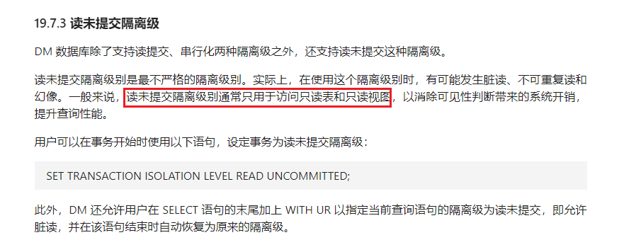
>
> 在[达梦社区-问答](https://eco.dameng.com/community/question/b6f1e0fe40314cd0de4039fe579a9023)官方人员也回答了该事物隔离级别下为只读, 所以 修改事务隔离级别吧
