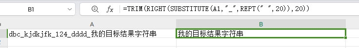

# 1. SUBSTITUTE

> **函数定义：**
>
>> **SUBSTITUTE(text,old_text,new_text,[instance_num])**
>> text ：字符串，可以是文本内容也可以是对含有文本的单元格的引用。
>> old_text ：要被替换掉的字符
>> new_text : 替换后的字符内容
>> Instance_num ：可以省略，代表替换text中的第几个old_text,
>>

## demo1: 达梦数据库批量生成触发器sql

> ```
> =TRIM(SUBSTITUTE(SUBSTITUTE(SUBSTITUTE(B:B, "[custom_table]", A:A), "[trigger_name]", A:A), "[custom_column]", "UPDATE_TIME"))
> ```
>
> 说明
>
> excel中A列表(函数汇总的A:A)为所有需要建触发器的表名, 达梦中查询所有包含某个字段的sql参考如下:
>
> ```sql
> select * from user_col_comments where owner='custom_schema' and column_name='custom_column_name'
> ```
>
> excel中B列表示sql模板, 如下: ([custom_table_name]的值为A列中的值, [custom_column_name]为你的更新时间字段, 例如函数中的"UPDATE_TIME")
>
> ```sql
>
> alter table custom_schema.[custom_table_name] alter column [custom_column_name] set default (CURRENT_TIMESTAMP(3));
> create or replace trigger custom_schema.TRG_[custom_table_name]
> before UPDATE on custom_schema.[custom_table_name] referencing OLD ROW AS "OLD" NEW ROW AS "NEW" for each row
> BEGIN :new.[custom_column_name]=CURRENT_TIMESTAMP(); END;
> ```

## demo2: 截取特定符号最后一次出现位置后面的内容(语义参考lastindexof)

> 给定字符串  `dbc_kjdkjfk_124_dddd_我的目标结果字符串`  , 最终结果需要输出为 `我的目标结果字符串`  , 则函数如下
>
> ```
> =TRIM(RIGHT(SUBSTITUTE(A1, "_", REPT(" ", 20)), 20))
> ```
> 函数的作用是将_替换成20个空格, 然后截取最右边20个字符, 最有去掉多余空格即为我们的结果
>
> 20这个数字可以替换其他大于 目标字符个数的 数字
>
> 
