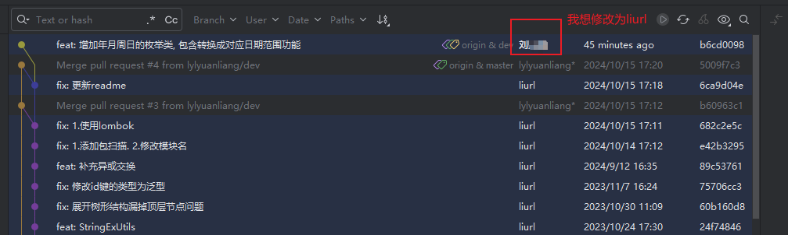
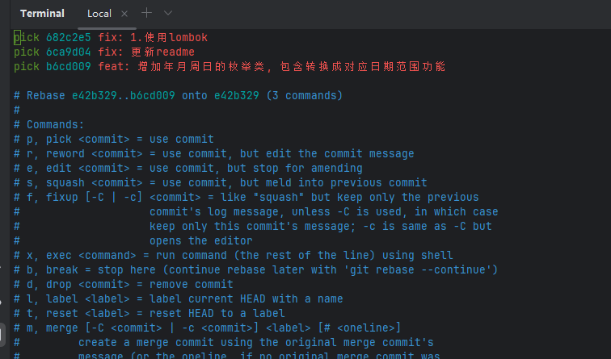
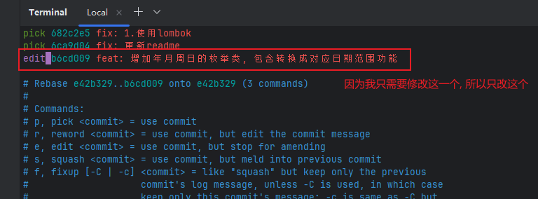
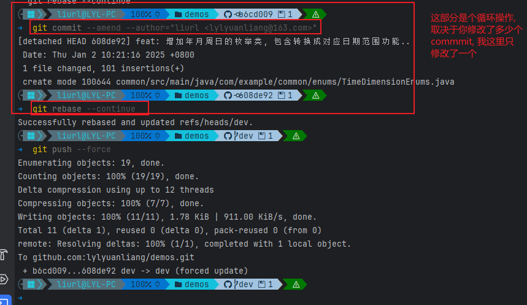
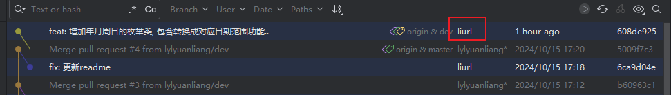

### 背景说明

有时候咱们需要对历史commit信息进行修改, 比如 我提交的user.name是错的, 我想修改一下, 如下如所示



### 操作

#### 修改最近一次提交 (暂未贴图)

```bash
git commit --amend --author="liurl <lylyuanliang@163.com>"
```

#### 修改多次提交

首先 `git rebase -i HEAD~n`, n为需要修改的commit 个数, 比如 `git rebase -i HEAD~3`
这时, 会弹出一个编辑器, 内容如下(格式为 `pick <commit-hash> Commit message`)



将 需要修改的commit前面的pick改为edit.



然后保存退出. 这时, Git 会停在你选择的第一个提交上, 接下来是个循环操作

a.`git commit --amend --author="liurl <lylyuanliang@163.com>"`
b.`git rebase --continue`
一直a和b步骤, 直到执行完.
然后 `git push --force`



最终结果如下



### 其他说明

如果想不同的仓库使用不同的user.name, 参考如下方法

方法一: 直接 git config user.name xxx, 不要加--global即可
