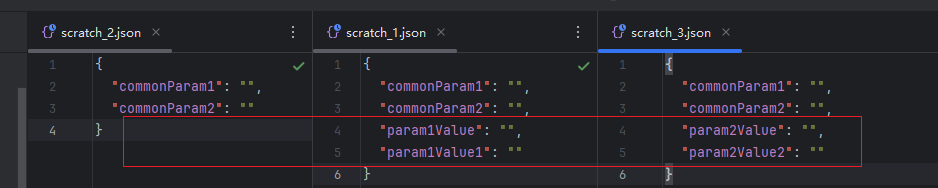
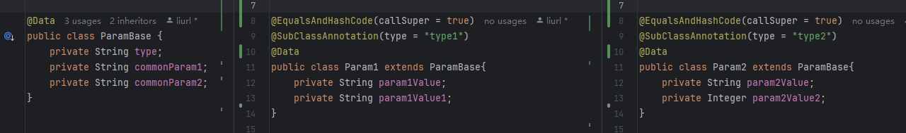
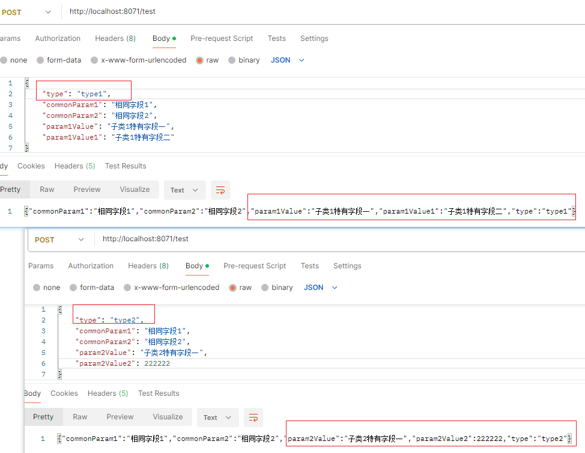

## 1. 前置说明

(自定义参数解析器从[章节2](#2-自定义参数解析器)开始)
在Spring的Controller中，我们可以通过 `@RequestParam`或 `@RequestBody`就可以将请求中的参数映射到具体的参数. 其原理都是通过 `HandlerMethodArgumentResolver`来解析的.此处仅做概要说明.后续实现方案将围绕 `HandlerMethodArgumentResolver`进行展开.

```java
// InvocableHandlerMethod.class 
protected Object[] getMethodArgumentValues(NativeWebRequest request, @Nullable ModelAndViewContainer mavContainer,
		Object... providedArgs) throws Exception {

	MethodParameter[] parameters = getMethodParameters();
	if (ObjectUtils.isEmpty(parameters)) {
		return EMPTY_ARGS;
	}

	Object[] args = new Object[parameters.length];
	for (int i = 0; i < parameters.length; i++) {
		MethodParameter parameter = parameters[i];
		parameter.initParameterNameDiscovery(this.parameterNameDiscoverer);
		args[i] = findProvidedArgument(parameter, providedArgs);
		if (args[i] != null) {
			continue;
		}
		// 是否支持
		if (!this.resolvers.supportsParameter(parameter)) {
			throw new IllegalStateException(formatArgumentError(parameter, "No suitable resolver"));
		}
		try {
			// 解析代码
			args[i] = this.resolvers.resolveArgument(parameter, mavContainer, request, this.dataBinderFactory);
		}
		catch (Exception ex) {
			// Leave stack trace for later, exception may actually be resolved and handled...
			if (logger.isDebugEnabled()) {
				String exMsg = ex.getMessage();
				if (exMsg != null && !exMsg.contains(parameter.getExecutable().toGenericString())) {
					logger.debug(formatArgumentError(parameter, exMsg));
				}
			}
			throw ex;
		}
	}
	return args;
}

```

补充说明一下, 这些参数解析器会在第一次加载后进行缓存, 下次经直接冲缓存中读取

```java
@Nullable
private HandlerMethodArgumentResolver getArgumentResolver(MethodParameter parameter) {
	HandlerMethodArgumentResolver result = this.argumentResolverCache.get(parameter);
	if (result == null) {
		for (HandlerMethodArgumentResolver resolver : this.argumentResolvers) {
			if (resolver.supportsParameter(parameter)) {
				result = resolver;
				this.argumentResolverCache.put(parameter, result);
				break;
			}
		}
	}
	return result;
}
```

## 2. 自定义参数解析器

自定义参数解析器需要实现 HandlerMethodArgumentResolver 接口

```java
public interface HandlerMethodArgumentResolver {

	boolean supportsParameter(MethodParameter parameter);

	@Nullable
	Object resolveArgument(MethodParameter parameter, @Nullable ModelAndViewContainer mavContainer,
			NativeWebRequest webRequest, @Nullable WebDataBinderFactory binderFactory) throws Exception;

}
```

接口中需要实现的有两个方法

* supportsParameter：该方法表示是否启用这个参数解析器，返回 true 表示启用，返回 false 表示不启用。
* resolveArgument：这是具体的解析过程，就是从 request 中取出参数的过程，方法的返回值就对应了接口中参数的值。

实现步骤

- 实现 `HandlerMethodArgumentResolver`,定义自定解析器

  - ```java
    @Component
    public class CustomRequestBodyResolver implements HandlerMethodArgumentResolver {
        @Override
        public boolean supportsParameter(MethodParameter parameter) {
            ....
        }

        @Override
        public Object resolveArgument(MethodParameter parameter, ModelAndViewContainer container,
                                      NativeWebRequest webRequest, WebDataBinderFactory factory) throws Exception {
        ...
        }
    }
    ```
- 将自定义的参数解析器配置到 HandlerAdapter

  - ```java
    @Configuration
    public class WebMvcConfig implements WebMvcConfigurer {
        @Override
        public void addArgumentResolvers(List<HandlerMethodArgumentResolver> resolvers) {
            resolvers.add(new CustomRequestBodyResolver());
        }
    }
    ```

接下来, 将一个**简单功能**来完整实现

### 2.1 功能描述

前端现有三个表单报文,



这三个报文中:

```
commonParam1和commonParam2是相同字段

param1Value和param1Value1独属于报文二

param2Value和param2Value2独属于报文三
```

现在这三个报文都需要提交后端同一个接口  POST  /test

```java
@PostMapping("/test")
public String test(@RequestBody ParamBase param) {
    return JSONObject.toJSONString(param);
}
```

如果不做任何处理的话, 那么我们的ParamBase类需要定义所有的字段, 以方便接受.

但是, ***我现在不想用一个类来接受, 我想根据不同的报文匹配不同的类*** !!!!!!! 接下来将实现这个功能

### 2.1 设计(实现思路)

1. 前端报文中需要传入一个type, 根据不同的type在参数解析的时候创建不同的对象
2. 缓存所有type对应的子类(方便匹配), (通过扫描自定义注解实现)
3. 自定义注解, 标识接口需要走自定义参数解析器
4. 自定义参数解析器, 根据 3 中的自定义注解判断是否启用, 然后根据type去匹配 2 中的子类

### 2.2 实现

#### 2.2.1 param定义

为方便对比, 就放了一张图片



#### 2.2.2 缓存所有子类

自定义注解 SubClassAnnotation

```java
@Target(ElementType.TYPE)
@Retention(RetentionPolicy.RUNTIME)
@Documented
public @interface SubClassAnnotation {
    String type() default "";
}
```

扫描自定义注解-定义缓存类

```java
public class SubClassesRegistry {

    private Map<String, Class<?>> subClasses;

    public SubClassesRegistry(Map<String, Class<?>> subClasses) {
        this.subClasses = subClasses;
    }

    public void setSubClasses(Map<String, Class<?>> subClasses) {
        this.subClasses = subClasses;
    }

    public Map<String, Class<?>> getSubClasses() {
        return subClasses;
    }
}
```

扫描自定义注解-扫描并缓存

```java
@Component
public class SubClassScanner implements ApplicationRunner {

    @Override
public void run(ApplicationArguments args) throws Exception {
        // 创建一个Map来保存带有特定注解的类
Map<String, Class<?>> annotatedClasses = new HashMap<>();

        // 获取@ComponentScan注解指定的扫描路径
//        String scanPackage = ClassUtils.getPackageName(ServiceApplication.class);
        // todo 这里写死包路径了, 以后再看有没有更好的办法
String scanPackage = "com.example";

        // 创建一个ClassPathScanningCandidateComponentProvider实例，并设置扫描路径
ClassPathScanningCandidateComponentProvider scanner = new ClassPathScanningCandidateComponentProvider(false);
        scanner.addIncludeFilter(new AnnotationTypeFilter(SubClassAnnotation.class));

        // 扫描指定包下带有特定注解的类
Set<BeanDefinition> annotatedClassesSet = scanner.findCandidateComponents(scanPackage.trim());

        // 遍历扫描到的类，将其放入Map中
for (BeanDefinition beanDefinition : annotatedClassesSet) {
            Class<?> annotatedClass = Class.forName(beanDefinition.getBeanClassName());
            SubClassAnnotation annotation = annotatedClass.getAnnotation(SubClassAnnotation.class);
            String name = annotation.type();
            annotatedClasses.put(name, annotatedClass);
        }

        // 将SubClassesRegistry注册为Spring Bean，并注入annotatedClasses
SubClassesRegistry bean = new SubClassesRegistry(annotatedClasses);
        SpringBeanUtils.registerSingletonBean("subClassesRegistry", bean);

}
}
```

#### 2.2.3 自定义注解-标识接口需要走自定义参数解析器逻辑

```java
@Target(ElementType.PARAMETER)
@Retention(RetentionPolicy.RUNTIME)
@Documented
public @interface CustomRequestBody {
    /**
     * 用来区分类型的字段 的名称, 这里默认type字段, 如果有需要, 自行修改
     * @return
     */
    String typeName() default "type";
}
```

#### 2.2.4 自定义参数解析器

自定义参数解析器, 贴出部分代码, 完整代码见[github 完整代码](https://github.com/lylyuanliang/demos/tree/master/common/src/main/java/com/example/common/resolver)

```java
@Component
public class CustomRequestBodyResolver implements HandlerMethodArgumentResolver {
    @Override
    public boolean supportsParameter(MethodParameter parameter) {
        return parameter.hasParameterAnnotation(CustomRequestBody.class);
    }

    @Override
    public Object resolveArgument(MethodParameter parameter, ModelAndViewContainer container,
                                  NativeWebRequest webRequest, WebDataBinderFactory factory) throws Exception {
        HttpServletRequest request = webRequest.getNativeRequest(HttpServletRequest.class);
        String requestBody = getRequestBody(request);

        Map<String, Object> resultMap = JSONObject.parseObject(requestBody, HashMap.class);

        Object param = createParam(parameter, resultMap);

        return param;
    }

    /**
     * 解析参数
     *
     * @param parameter 方法参数
     * @param paramMap  数据
     * @return
     */
    public Object createParam(MethodParameter parameter, Map<String, Object> paramMap) {
        String typeFileName = "";
        Annotation[] parameterAnnotations = parameter.getParameterAnnotations();
        for (Annotation annotation : parameterAnnotations) {
            if (annotation instanceof CustomRequestBody) {
                typeFileName = ((CustomRequestBody) annotation).typeName();
            }
        }
        SubClassesRegistry subClassesRegistry = SpringBeanUtils.getBean(SubClassesRegistry.class);
        String type = (String) paramMap.get(typeFileName);
        // 获取对应的子类对象
        Class<?> clazz = subClassesRegistry.getSubClasses().get(type);

        if (!Objects.isNull(clazz)) {
            try {
                return convert(paramMap, clazz);
            } catch (Exception e) {
                throw new RuntimeException(e);
            }
        }
        throw new RuntimeException("不支持的类型");
    }
}
```

将自定义的参数解析器配置到 HandlerAdapter

```java
@Configuration
public class WebMvcConfig implements WebMvcConfigurer {
    @Override
    public void addArgumentResolvers(List<HandlerMethodArgumentResolver> resolvers) {
        resolvers.add(new CustomRequestBodyResolver());
    }
}
```

#### 2.2.5 定义接口

@RequestBody注解替换成CustomRequestBody

```java
@PostMapping("/test")
public String test(@CustomRequestBody ParamBase param) {
    return JSONObject.toJSONString(param);
}
```

#### 2.2.6 测试



剩下一个问题, 当type不传或传默认值, 匹配ParamBase, 这个暂未实现

## PS. spring中常用resolver举例

### PS.1 RequestParamMapMethodArgumentResolver

主要用于处理以下场景中的接口参数解析：(来自chatgpt总结)

`HandlerMethodArgumentResolver` 用于解析带有 `@RequestParam` 注解且未指定参数名称的 `Map` 方法参数。以下是典型的使用场景：

1. **带有 `@RequestParam` 注解的 `Map` 参数**：

   - 当 `@RequestParam` 注解未指定请求参数名称时，所有请求参数的名称/值对都会被映射到方法参数中的 `Map<String, String>`。
   - 适用于动态处理未知数量的请求参数的场景。
2. **处理文件上传的 `MultipartFile`**：

   - 如果方法参数类型是 `Map<String, MultipartFile>`，则请求中的多部分文件会按名称映射到 `Map` 中。
   - 每个 `MultipartFile` 对应一个参数名称，适用于文件上传的场景。
3. **处理多值参数的 `MultiValueMap`**：

   - 当方法参数类型是 `MultiValueMap<String, String>` 时，所有请求参数及其多个值会被映射到 `MultiValueMap`。
   - 适用于同一请求参数有多个值的场景（例如多选框或同一名称的多个文件上传）。
   - 如果使用 `MultiValueMap<String, MultipartFile>`，则支持多个同名文件的上传。

### PS.2 PathVariableMethodArgumentResolver

主要用于处理以下场景中的接口参数解析：(来自chatgpt总结)

`HandlerMethodArgumentResolver` 主要用于处理带有 `@PathVariable` 注解的方法参数。以下是典型的使用场景：

1. **`@PathVariable` 注解的参数解析**：

   - 将 URI 路径中的变量映射为方法参数。
   - 用于 RESTful 接口中的路径参数，如 `/users/{id}`。
   - `@PathVariable` 参数始终是必需的，不能设置默认值。
2. **`Map` 类型的路径变量**：

   - 当方法参数类型是 `Map<String, String>` 时，`@PathVariable` 注解中的名称用于解析 URI 中的路径变量。
   - 适用于需要接收多个路径变量并将其动态映射为 `Map` 的场景。
   - 路径变量的值通过类型转换机制（`Converter` 或 `PropertyEditor`）转换为 `Map`。
3. **路径变量的类型转换**：

   - `WebDataBinder` 自动处理路径变量的类型转换。
   - 当路径变量的默认 `String` 类型不匹配方法参数时（如 `Integer`、`Long`），`WebDataBinder` 会将其转换为正确的类型。

### PS.3 RequestResponseBodyMethodProcessor

主要用于处理以下场景中的接口参数解析：(来自chatgpt总结)

`HandlerMethodArgumentResolver` 负责处理带有 `@RequestBody` 注解的方法参数，同时通过 `HttpMessageConverter` 处理带有 `@ResponseBody` 注解的方法返回值。以下是典型的使用场景：

1. **解析请求体数据**：

   - `@RequestBody` 注解用于将请求体数据解析为方法参数对象。
   - 通过 `HttpMessageConverter` 读取请求体，并将其转换为相应的 Java 对象。
2. **处理响应体数据**：

   - `@ResponseBody` 注解用于将方法返回值写入到响应体中。
   - 同样通过 `HttpMessageConverter` 将 Java 对象转换为响应格式（如 JSON、XML）并返回给客户端。
3. **请求体参数的验证**：

   - 当 `@RequestBody` 参数带有触发验证的注解（如 `@Valid` 或 `@Validated`），会自动进行校验。
   - 验证失败时，抛出 `MethodArgumentNotValidException` 异常。
   - 如果 `DefaultHandlerExceptionResolver` 被配置，校验失败将导致返回 HTTP 400 状态码。
