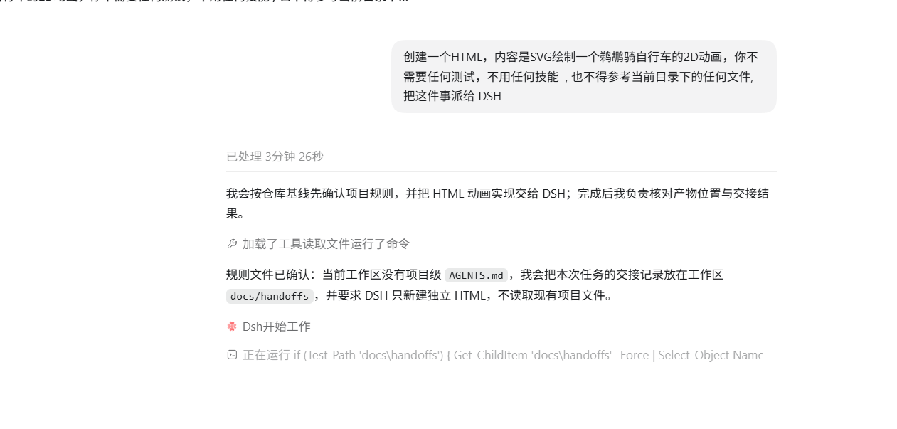

# DSH Crew 派发链路与排障手册

更新时间：2026-09-30
适用版本：`@zseven-w/dsh-crew 0.1.0-rc.11` · `codex-cli 0.159.0` · `@hytime/dsh-thinking-effort 0.3.6`

## 适用场景

Codex 派发到 DSH 的链路有 5 个环节，任何一个断了都会表现成"没反应"或"报错"。这篇把**症状 → 证据 → 根因 → 处理**按环节整理，并给出每种证据的读取命令。

链路分段：

```text
你说话
  └─① Codex 决定调用哪个工具   ← 最容易错：它会用自建子代理顶替
      └─② dsh-crew MCP 是否注册且被调用
          └─③ hub 是否可达（DSH 实例端口）
              └─④ 档位→模型路由是否可用（provider / model / 推理档位）
                  └─⑤ worker 实际执行（cwd、锁、超时）
```

**分诊原则：先确定断在哪一段，再动手。** 不要看到"派发失败"就去改配置。

## 一眼分诊：三条命令

```powershell
# ① Codex 侧有没有注册这个 MCP
codex mcp list | Select-String dsh-crew

# ② hub 通不通（把 <port> 换成 DSH 实际端口）
Invoke-RestMethod "http://127.0.0.1:<port>/_dsh/dsh-crew/providers" | ConvertTo-Json -Depth 5

# ③ 最近的任务落在哪一层
(Invoke-RestMethod "http://127.0.0.1:<port>/_dsh/dsh-crew/jobs").jobs |
  Select-Object -First 5 id,status,provider,model,effort,cwd,error
```

- ① 空 → 断在 ②，看[症状5 MCP 没注册](#症状5-mcp-没注册)
- ② 连接失败 → 断在 ③，看[症状2 缺少 API key](#症状2-缺少-api-key)
- ③ 有 job 且 `error` 明确 → 断在 ④/⑤，按错误关键字对号入座

## 证据读取方法（排障必备）

| 证据 | 位置 / 命令 | 能回答什么 |
|---|---|---|
| hub 任务列表 | `GET /_dsh/dsh-crew/jobs`（`?wait=N` 长轮询单条：`/jobs/<id>?wait=30`） | 任务有没有派出去、落在哪个 provider/model、成功还是失败 |
| hub 路由与绑定 | `GET /_dsh/dsh-crew/providers` | 档位实际绑到哪、provider 是否存在 |
| hub 插件配置 | `GET /_dsh/dsh-crew/config` | `hub_url`、`default_effort`、`tier_policy` 的真值 |
| 状态分片 | `C:\Users\<you>\.config\dsh-crew\status.d\*.json`（每个 writer 一个文件，30 分钟内视为新鲜） | 不依赖 hub 也能看到 job 进度，适合外部监视 |
| Codex 会话记录 | `C:\Users\<you>\.codex\sessions\YYYY\MM\DD\rollout-*.jsonl` | 模型到底调了哪个工具、工具返回了什么 |
| Codex 运行日志 | `C:\Users\<you>\.codex\logs_2.sqlite`（表 `logs`） | MCP 连接、agent role 解析、钩子相关告警 |
| hook 日志 | `C:\Users\<you>\.codex\hooks\logs\*.log` | 钩子有没有被调用、有没有拦下 |
| DSH 侧会话 | `C:\Users\<you>\.dsh\storages\session_projcache\sessions\session-*.json` | hub job 对应的 DSH 会话（可进 DSH 界面看过程） |

查"模型到底调了什么工具"：

```powershell
$f = Get-ChildItem "$env:USERPROFILE\.codex\sessions" -Recurse -Filter "rollout-*.jsonl" |
     Sort-Object LastWriteTime -Descending | Select-Object -First 1
Select-String -Path $f.FullName -Pattern '"name":"(spawn_agent|exec|mcp__dsh_crew__[a-z_]+)"' -AllMatches |
  ForEach-Object { $_.Matches.Value } | Group-Object | Select-Object Count,Name
```

> 关键判据：出现 `spawn_agent` 而没有 `mcp__dsh_crew__*` → 模型用了自建子代理（本手册第一节）。

## 症状1 Codex 自己开了个子代理

**典型表现**：Codex 回复里出现 "xxx 开始工作"、"子智能体"标签页，名字可能是 `Dsh`、`ds-flash`、某个任务名；DSH 侧 hub 里查不到任何 job。



**证据**：

```powershell
# ① rollout 里只有 spawn_agent，没有 mcp__dsh_crew__*
# ② hub 里没有对应 job
(Invoke-RestMethod "http://127.0.0.1:<port>/_dsh/dsh-crew/jobs").jobs.Count
```

**根因（通常是三件事叠加）**：

1. **`dsh-crew` 的工具不在 Codex 的顶层工具列表里**，它们在 `exec` 的代码模式命名空间下（`tools.mcp__dsh_crew__*`）。模型按顶层工具名找会得出"没有这个工具"。
2. **"worker" 这个词在 Codex 里已经有主人**：插件的角色文件叫 `ds-flash` / `ds-pro`，描述里写着 worker，天然与"派给 worker"撞车。
3. 一旦子代理模型校验失败（例如角色绑了不支持的模型），模型会"自己想办法"，最后自己把活干了。

**处理（按性价比）**：

1. **点名工具路径**：

   ```text
   用 exec 调用 tools.mcp__dsh_crew__dsh_run_worker，参数
   {"task":"<自包含任务>","tier":"flash","cwd":"<工作区绝对路径>"}；不要用 spawn_agent。
   ```

2. **删掉插件的角色文件**（去掉歧义源）：

   ```powershell
   Remove-Item "$env:USERPROFILE\.codex\agents\ds-flash.toml","$env:USERPROFILE\.codex\agents\ds-pro.toml" -Force
   ```

3. **加 hook + 全局 AGENTS 规则**（推荐，一劳永逸）：见[第 4 篇配置项地图](./4.DSH%20Crew%20配置项地图.md) 的 hooks 一节，本机已验证能拦下 `spawn_agent`。

**先确认工具真的暴露给了模型**（比问模型可靠）：

```text
用 exec 执行这段 JS 并输出结果：text(Object.keys(tools).sort().join(', '))
```

返回里应包含：

```text
mcp__dsh_crew__dsh_run_worker, mcp__dsh_crew__dsh_spawn_worker,
mcp__dsh_crew__dsh_worker_cancel, mcp__dsh_crew__dsh_worker_config,
mcp__dsh_crew__dsh_worker_result, mcp__dsh_crew__dsh_worker_status
```

没有这六个 → 回到[症状5 MCP 没注册](#症状5-mcp-没注册)。

## 症状2 缺少 API key

```text
llm-deepseek: no API key for provider route "deepseek-official"; store DEEPSEEK_API_KEY ...
MISSING_CREDENTIAL
```


**根因**：档位还绑在出厂默认路由 `deepseek-official`（需要单独 API key 的路由）。**本方案不需要这条路由。**

**处理**：按[全流程教程](./1.DSH%20Crew%20接入%20Codex%20全流程教程.md)步骤 3，改成 `deepseek-account` 或你已配好的第三方 provider，然后**重启 Codex**（MCP 启动时读一次配置）。

**验证**：

```powershell
(Invoke-RestMethod "http://127.0.0.1:<port>/_dsh/dsh-crew/providers").bindings
# 期望 custom = true
```

## 症状3 推理档位不支持

```text
provider "huoshan" model "DeepSeek-V4.1-Flash" does not support reasoning effort "high"
UNSUPPORTED_REASONING_EFFORT
```


**根因**：插件**总会**带上 `default_effort`，而该模型在 DSH 里没有声明推理档位能力（或声明的集合里没有这个值）。

三种情况要分清：

| 情况 | 判断 | 处理 |
|---|---|---|
| 模型完全没有档位声明 | 换成 `off` 也报同样的错 | 装 `@hytime/dsh-thinking-effort` 补档位；或改用 DSH 内置目录里的模型（如 `deepseek-account`） |
| 有声明但没有这个档位 | 报错里点名 `"off"` 等具体值 | 把 `default_effort` 改成该模型支持的档位（本机火山 `DeepSeek-V4.1-Flash` 是 `minimal/high/xhigh/max`，**没有 off**） |
| 只有部分模型被自动补档位 | 同一 provider 下 A 模型能跑、B 模型报错 | 去「第三方模型思考强度档位」给 B 模型手动补 |

**验证**：改完重启 Codex，重派最小任务，hub 里该 job `status = done`。

## 症状4 模型不存在

**根因**：插件的角色文件里写死了 `model = "gpt-5.4-mini"`，而当前 Codex 版本/账号不支持该模型（模型目录里根本没有它）。

**处理**：删掉角色文件（推荐，本教程不用角色路线），或把角色文件里的 `model` 改成你账号支持的模型（例如会话模型本身）。改完重启 Codex。

> 顺带：插件设置页点「安装 / 更新」会重新写回原模板，所以这个坑会复现——要么别点，要么反馈给插件作者。

## 症状5 MCP 没注册

**检查顺序**：

1. `codex mcp list` 有没有 `dsh-crew`；
2. 没有 → 到 `C:\Users\<you>\.codex\config.toml` 看 `[mcp_servers.dsh-crew]` 段在不在；
3. 在，但列表还是没有 → 看启动告警：

```powershell
codex exec --skip-git-repo-check "ok" 2>&1 | Select-String "warning|ignoring"
```

**常见原因**：

- **TOML 转义错误**：Windows 路径写成了 `"C:\Users\..."`。必须写 `"C:\\Users\\..."`，否则解析失败，**Codex 会静默忽略整段定义**（日志里表现为 `failed to parse agent role file ... TOML parse error`）。
- **`command = "node"` 找不到**：Node 不在 PATH；改成 `node.exe` 绝对路径。
- **注册后没重启 Codex**：新会话才会带上新工具。

**验证**：`codex mcp list` 显示 `dsh-crew ... enabled`；或按上面的 `Object.keys(tools)` 自查。

## 症状6 工作区被占用

**根因**：cwd 咨询锁——同一工作区**同时只允许一个写者**，第二个派发会被**拒绝**（不是排队）。

**处理**：

- 等前一个 job 结束，或取消它：

  ```powershell
  # 列出持有者（dsh_worker_status 的 cwd-lock 条目也会显示）
  Invoke-RestMethod "http://127.0.0.1:<port>/_dsh/dsh-crew/jobs/<jobId>/cancel" -Method Post
  ```

- 只读任务可以显式放开：`allow_concurrent_cwd: true`（**不要**给写任务用）。
- 或者派到不同目录。

## 症状7 cwd 不是绝对路径

**根因**：hub 侧硬校验绝对路径；插件虽然会把相对路径按"调用方当前目录"解析，但**"调用方当前目录"是 dsh-crew MCP 进程的 `process.cwd()`，不保证等于你 Codex 会话的工作区**。

**处理**：派发时**显式传绝对路径** `cwd`：

```json
{"task":"...","tier":"flash","cwd":"D:\\file_save\\ai_daily"}
```

**验证**：hub 该 job 的 `cwd` 字段就是你传的路径。

## 症状8 命令回车没反应

插件的 Codex 集成装的是 **prompt**（`~/.codex/prompts/*.md`），注意三点：

1. 用**斜杠**命令 `/dsh-status`，不是 `$dsh-status`（`$` 在 Codex 里是 skill 的语法）。
2. 从菜单里选中它只是**把命令填进输入框**（源码行为：`setText` + `focus`，不发送），要**再按一次回车**才发。弹层还在吃回车时先按 `Esc` 关掉弹层。
3. 发送出去后，会话里显示的会是 prompt 的**正文**（例如 `Call the \`dsh_worker_status\` tool ...`），不是字面的 `/prompts:dsh-status`。

## 错误关键字速查表

| 关键字 / 错误 | 所属环节 | 直接处理 |
|---|---|---|
| `MISSING_CREDENTIAL` / `no API key for provider route` | ④ 路由 | 换掉 `deepseek-official` 绑定 |
| `UNSUPPORTED_REASONING_EFFORT` | ④ 路由 | 补档位 / 改 `default_effort` |
| `Unknown model ...` | ④ 路由 | 换模型 id（含角色文件里的） |
| `cwd must be an absolute path` | ⑤ 执行 | 派发时传绝对路径 |
| `is already held by a running worker` | ⑤ 执行 | 等/取消/换目录 |
| `still running after Ns; poll with dsh_worker_result` | ⑤ 执行 | 任务超过超时时间，用 `dsh_worker_result` 取结果 |
| `hub not reachable` / 连接被拒 | ③ hub | 检查 DSH 是否在跑、`hub_url` 端口 |
| `TOML parse error` | ② 注册 | 路径反斜杠转义 |
| `Tool call blocked by PreToolUse hook` | ② 注册 | 钩子生效了，改用 `tools.mcp__dsh_crew__dsh_run_worker` |

## 一次完整排障长什么样（证据链示例）

本机真实案例：

1. **现象**：说"把这件事派给 DSH"，Codex 自己开了个叫 `Dsh` 的子代理。
2. **证据 1**：hub `/jobs` 里没有新 job → 任务根本没出去。
3. **证据 2**：rollout 里那次调用是 `spawn_agent`，没有任何 `mcp__dsh_crew__*`。
4. **证据 3**：`Object.keys(tools)` 里六个 `mcp__dsh_crew__*` 都在 → 工具已注册，是**选择问题**，不是链路问题。
5. **结论**：模型把"worker"理解成 Codex 自己的角色子代理。
6. **处理**：删角色文件 + 点名工具路径 + 加 hook（hook 日志随后出现 `BLOCK tool=collaborationspawn_agent`）。
7. **复验**：新会话派发 → hub 出现 `status=done` 的 job，`provider/model` 与配置一致。

> 排障时**优先相信文件与接口**（rollout、hub、日志），不要相信模型的自述——它会说"我没有这个工具"，而实际上工具就在 `tools` 命名空间里。

## 相关笔记

- [DSH Crew 接入 Codex 全流程教程](./1.DSH%20Crew%20接入%20Codex%20全流程教程.md)
- [DSH Crew 配置项地图（界面 vs 文件）](./4.DSH%20Crew%20配置项地图.md)
- [DSH Crew 本地看板使用说明](./3.DSH%20Crew%20本地看板使用说明.md)
