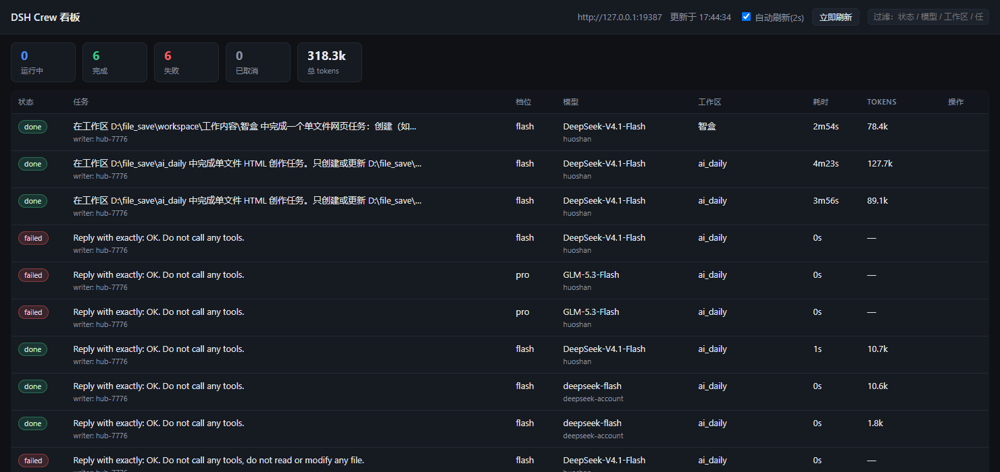

# DSH Crew 本地看板使用说明

更新时间：2026-09-30
本机验证环境：Windows 11 · Node `v24.15.0` · DSH Crew `0.1.0-rc.11`

## 适用场景

DSH Crew 的 worker 任务，官方只提供了一个查看入口：**DSH 设置 → DSH Crew → Worker 任务 卡片**（要点进设置页才能看）。这篇提供一个**独立的本地看板**：打开浏览器就能看全部 worker 任务，自动刷新。

适合：

- 想一眼看到"哪些 worker 在跑、跑了多久、成功还是失败、失败原因是什么"。
- 想把任务列表放在第二个屏幕/浏览器标签里长期开着。
- 想按工作区、模型、状态快速过滤。



## 为什么必须有一个本地服务（而不是一个 HTML 文件）

hub 的 HTTP 响应**不带任何 CORS 头**，并且显式写死了同源策略：

```js
// dsh-crew 源码 hub/index.mjs
res.writeHead(status, {
  'content-type': 'application/json; charset=utf-8',
  'cross-origin-resource-policy': 'same-origin',
  ...
});
```

所以：

- 用 `file://` 直接打开一个 HTML 去 `fetch('http://127.0.0.1:19387/_dsh/dsh-crew/jobs')` → **会被浏览器拦掉**。
- 页面必须与数据接口**同源**。本方案用一个极小的 Node 服务做同源代理：页面只跟它说话，它从本机 loopback 去取 hub 数据。

## 文件清单

```text
scripts/crew-dashboard/
├── server.mjs                  # 代理 + 静态页服务（无第三方依赖，Node 内置模块）
├── index.html                  # 看板页面（原生 JS，无构建步骤）
└── start_crew_dashboard.bat    # 启动入口（双击）
```

## 部署

1. 把 `scripts/crew-dashboard/` 整个目录复制到你机器上的任意位置（本机实际放在 `D:\file_save\tool\dsh-crew-dashboard\`）。
2. 确认 Node 可用：
   ```powershell
   node -v
   ```
3. 双击 `start_crew_dashboard.bat`。

> bat 里有两处硬编码路径，换机器要改：
> - `set "NODE=D:\soft\nodejs\node.exe"`（找不到时会回退到 PATH 里的 `node`）
> - `set "CHROME=C:\Program Files\Google\Chrome\Application\chrome.exe"`（找不到时回退到系统默认浏览器）

## 启动脚本的逻辑（实测行为）

```text
健康检查 http://127.0.0.1:3940/health
├─ 通  → 只打开 Chrome，不重复启动
└─ 不通 → 后台隐藏启动 node → 最多等 15 秒端口就绪 → 打开 Chrome
          （启动失败会 pause，并打印 node 路径与 server.mjs 路径）
```

本机实测：

```text
第一次： [dsh-crew] starting dashboard on port 3940 ... → [dsh-crew] dashboard is up.
第二次： [dsh-crew] already running - opening browser...   （进程数仍为 1）
```

## 界面功能

| 区域 | 说明 |
|---|---|
| 顶部 KPI | 运行中 / 完成 / 失败 / 已取消 / 总 tokens |
| 过滤框 | 按状态、模型、provider、工作区、任务内容实时过滤 |
| 任务行 | 状态 pill、任务摘要、writer（哪个进程写的）、失败原因 |
| 耗时列 | 运行中的任务每秒走字 |
| tokens 列 | 该 job 的输入+输出 token 合计 |
| 取消按钮 | 仅运行中的任务显示，调用 `POST /jobs/<id>/cancel` |
| 点行展开 | 显示 id、cwd、开始/结束时间、完整任务文本 |

页面每 **2 秒**自动刷新一次（可取消勾选「自动刷新」）。

## 接口

| 路径 | 方法 | 说明 |
|---|---|---|
| `/` | GET | 看板页面 |
| `/api/jobs` | GET | 代理 hub 的 `/_dsh/dsh-crew/jobs`，并把 `hub` 地址回填给页面 |
| `/api/cancel` | POST | body `{"id":"hub-1-xxxx"}`，代理 hub 的取消接口 |
| `/health` | GET | `{"ok":true,"hub":"...","port":3940}` |

**hub 地址是自动读的**：服务启动时/每次请求都读 `~/.config/dsh-crew/config.json` 的 `hub_url`，所以 DSH 桌面版换端口后不用改这个看板。

## 资源占用（本机实测）

| 项 | 占用 |
|---|---|
| 内存（工作集） | **约 61 MB** |
| 空闲 CPU | **0.00%**（6 秒内 0.000 秒） |
| 页面开着、每 2 秒轮询 | **约 0.31% 单核**（10 秒 0.031 秒） |

对比同一时刻：Chrome 20 个进程合计约 2.1 GB、Codex 桌面版 10 个进程约 1.4 GB、DSH 桌面版约 0.95 GB。看板属于可忽略量级。

## 启停

```powershell
# 启动（或直接双击 bat）
node "D:\file_save\tool\dsh-crew-dashboard\server.mjs"

# 停止（按端口找进程）
Get-NetTCPConnection -LocalPort 3940 | ForEach-Object OwningProcess | ForEach-Object { taskkill /PID $_ /F }

# 换端口
$env:CREW_DASH_PORT=4000; node server.mjs
# 同时要改 bat 里的 set "PORT=3940"
```

## 二次改造点

| 想改什么 | 位置 |
|---|---|
| 端口 | `server.mjs` 的 `PORT`（读 `CREW_DASH_PORT`）；bat 的 `set "PORT="` |
| 刷新频率 | `index.html` 末尾 `setInterval(..., 2000)` |
| 增加列（如 origin_chain、sessionId） | `index.html` 的 `render()` 与表头 `<th>` |
| 换配色 | `index.html` 顶部 `:root` 变量 |
| 只显示运行中 | `render()` 里的 `list.filter(...)` |
| 从文件读（不依赖 hub） | 读 `~/.config/dsh-crew/status.d/*.json`（每个 writer 一个分片，30 分钟内算新鲜） |

## 已知限制

- hub 数据源是 DSH 桌面版内的 hub；**DSH 没运行时看板只会显示缓存的分片文件内容或空列表**。
- 它是轮询而非服务端推送，所以最小延迟约 2 秒。
- 看板只读 + 取消，不能派发（派发请从 Codex 走 `dsh_run_worker`）。
- 笔记仓库里这份是**随文档归档的副本**；你本机实际运行目录以 `D:\file_save\tool\dsh-crew-dashboard\` 为准（两份内容一致，双击任一份的 bat 都能用，端口冲突时后启动的那份只会打开浏览器）。

## 相关笔记

- [DSH Crew 接入 Codex 全流程教程](./1.DSH%20Crew%20接入%20Codex%20全流程教程.md)
- [DSH Crew 派发链路与排障手册](./2.DSH%20Crew%20派发链路与排障手册.md)
- [DSH Crew 配置项地图（界面 vs 文件）](./4.DSH%20Crew%20配置项地图.md)
