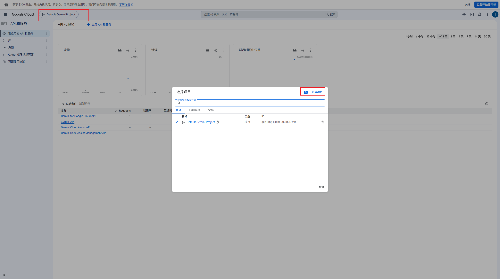
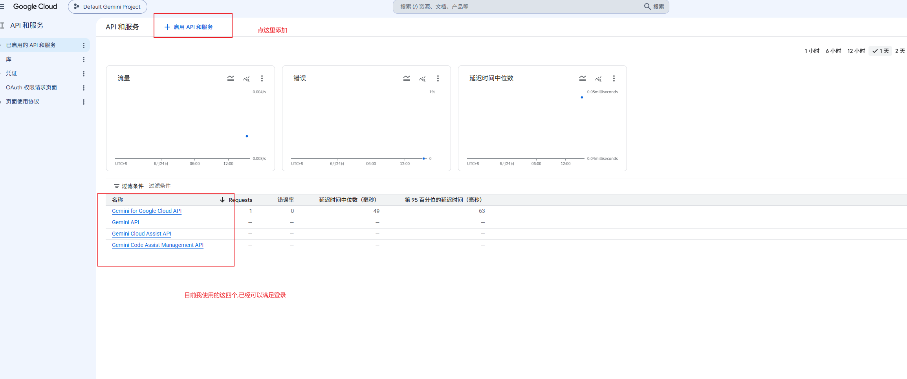
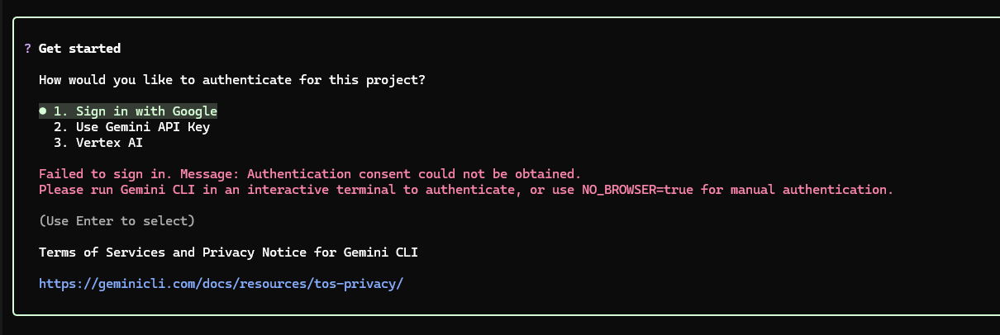

# gemini 登录 (windows)

使用"Sign in with Google"这个选项,其他登录选项暂未记录

## 1. google设置

打开控制台[控制台](https://console.cloud.google.com/apis/dashboard)

### 1.1. 新建项目

这里可以新建, 也可以直接使用默认项目, 然后记住项目ID,后面会用



### 1.2. 启用api服务



## 2. 系统环境变量

环境变量可选, 如果不配置, 就需要在终端(如powershell)中输入下面一长串, 有点不方便

```bash
$env:https_proxy="http://127.0.0.1:改成自己的网络代理端口号";$env:GOOGLE_CLOUD_PROJECT="改成自己的项目ID";gemini
```

### 2.1. 环境变量清单

| 环境变量名           | value                                     | 说明                                                            |
| -------------------- | ----------------------------------------- | --------------------------------------------------------------- |
| GOOGLE_CLOUD_PROJECT | 自己的项目ID                              | 在google控制台里面创建的那个项目                                |
| HTTP_PROXY           | http://127.0.0.1:改成自己的网络代理端口号 | 梯子,这个环境变量也能解决powershell不也能自动使用本地代理的问题 |
| HTTPS_PROXY          | http://127.0.0.1:改成自己的网络代理端口号 | 梯子,这个环境变量也能解决powershell不也能自动使用本地代理的问题 |

## 3. 登录

按照提示一步一步操作就行了



## 4. 扩展:安装superpower

```bash
# 安装扩展
gemini extensions install https://github.com/obra/superpowers

# 更新扩展
gemini extensions update superpowers
```
