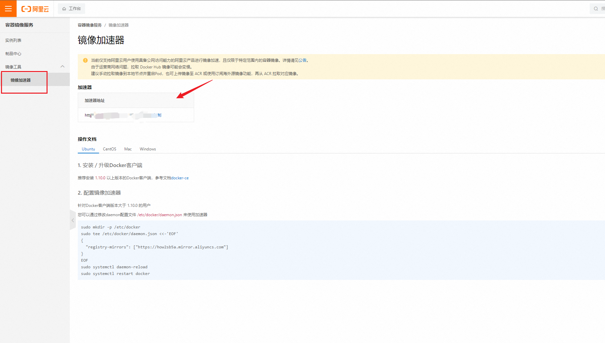
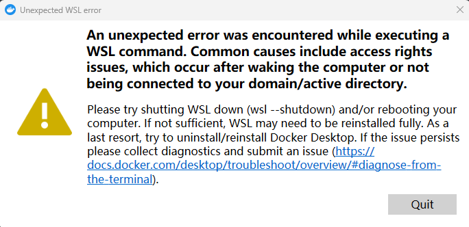

#### 1. 安装

略.  如果需要启用wsl, 请先看 [wsl](../wsl/1.wsl.md)

#### 2. 存储迁移

```powershell
#1.查看wsl安装哪些分支
wsl -l -v

#2.关闭所有的分支及wsl2
wsl --shutdown

#3.导出相关分支
#3.1 迁移 docker-desktop-data
wsl --export docker-desktop-data D:\fileSave\wsl\temp\docker-desktop-data.tar   # 导出
wsl --unregister docker-desktop-data #注销
wsl --import docker-desktop-data D:\fileSave\wsl\docker\data D:\fileSave\wsl\temp\docker-desktop-data.tar --version 2 #导入

#3.2 迁移 docker-desktop
wsl --export docker-desktop D:\fileSave\wsl\temp\docker-desktop.tar
wsl --unregister docker-desktop
wsl --import docker-desktop D:\fileSave\wsl\docker\desktop D:\fileSave\wsl\temp\docker-desktop.tar --version 2
```

#### 3 镜像加速(阿里云)

##### 3.1 地址

[阿里云](https://cr.console.aliyun.com/cn-hangzhou/instances)

##### 3.2 相关截图



#### **. 可能遇到的问题

##### **.1 启动失败, An unexpected error was encountered while executing a WSL command. Common causes include access rights issues, which occur after waking the computer or not being connected to your domain/active directory.

> 
>
> 解决办法, 启动wsl子系统, 如果子系统启动失败, 则输入 `netsh winsock reset`, 可以参考[wsl](../wsl/1.wsl.md)的  **参考的对象类型不支持尝试的操作**
