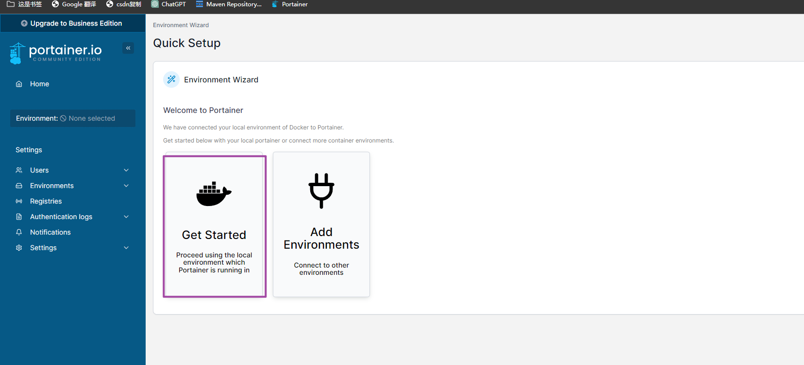
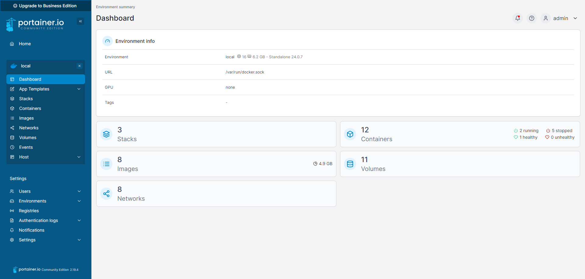

# # 官网文档

[官网文档](https://docs.portainer.io/start/install-ce/server/docker/wsl)

# 创建容器

[docker-compose.yml](../../../学习记录/docker/1.docker-compose文件样例/compose/portainer/docker-compose.yml)

# 初始化

## 访问

http://localhost:9000

或者 https://localhost:9443   (需要将9443端口映射出来)

## admin密码设置

第一次登录要设置相关密码

## 根据向导进行设置

