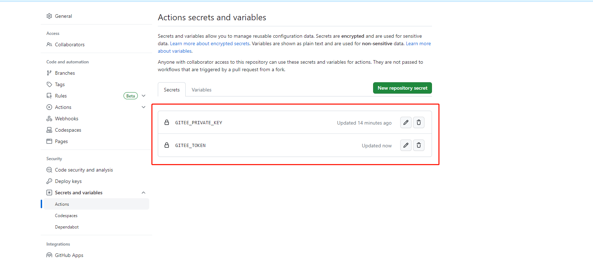
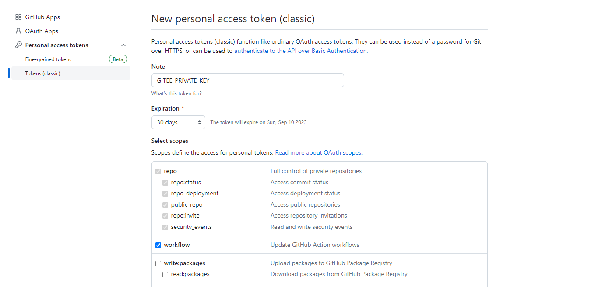
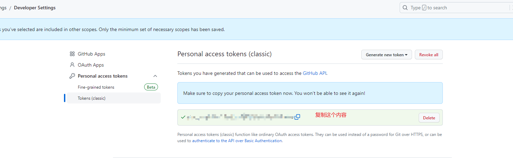
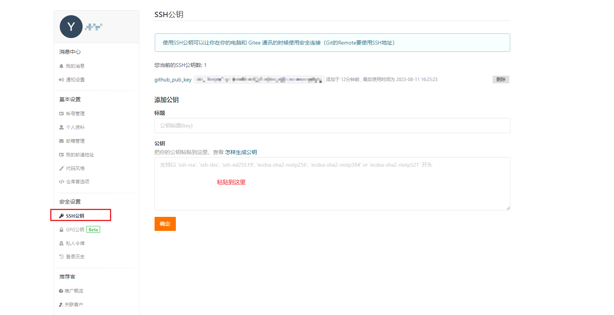

#### 1. actions仓库

[官方仓库](https://github.com/marketplace?type=actions)       [awesome actions 仓库](https://github.com/sdras/awesome-actions)

#### 2. 基本术语

> * **workflow** :（工作流程）：持续集成一次运行的过程，就是一个 workflow。
> * **job** （任务）：一个 workflow 由一个或多个 jobs 构成，含义是一次持续集成的运行，可以完成多个任务。
> * **step** （步骤）：每个 job 由多个 step 构成，一步步完成。
> * **action** （动作）：每个 step 可以依次执行一个或多个命令（action）。

#### 3. workflow 文件简要说明

> - github action的配置文件, 存放在代码仓库的 `.github/workflows` 目录
> - 格式为 `yml`, github会自动执行 `.github/workflows`中的yml文件. (一个仓库可以有多个配置文件)

##### 3.1 配置说明 ([官方文档](https://help.github.com/en/articles/workflow-syntax-for-github-actions))

| 字段             | 说明                                                                                                                                               | 默认值               | 样例                                                            |
| ---------------- | -------------------------------------------------------------------------------------------------------------------------------------------------- | -------------------- | --------------------------------------------------------------- |
| name             | workflow 的名称                                                                                                                                    | 当前 workflow 的文件 | name: demo                                                      |
| **`on`** | 指定触发 workflow 的条件，通常是某些事件<br />也可以是事件的数组                                                                                   |                      | on: push<br />on: [push, pull_request]                          |
| jobs             | 表示要执行的一项或多项任<br />`jobs`字段里面，需要写出每一项任务的 `job_id`，具体名称自定义。<br />`job_id`里面的 `name`字段是任务的说明。 |                      | jobs:<br />    myFirstJob: <br />        name: myFirstJob |

##### 3.2 配置样例

```yml
name: Greeting from Mona
on: push

jobs:
  my-job:
    name: My Job
    runs-on: ubuntu-latest
    steps:
    - name: Print a greeting
      env:
        MY_VAR: Hi there! My name is
        FIRST_NAME: Mona
        MIDDLE_NAME: The
        LAST_NAME: Octocat
      run: |
        echo $MY_VAR $FIRST_NAME $MIDDLE_NAME $LAST_NAME.
```

#### 4. 完整创建流程demo

##### 4.1 secret



###### 4.1.1 github secret

###### 4.1.1.1 生成secret

> 菜单地址 `setting->Developer Settings->Personal access tokens->tokens(classic)->Generate new token (classic)`
>
> 
>
> 

###### 4.1.1.2 设置secret

> 菜单地址 `[github仓库]->Settings->Secrets and variables->Actions->New Secrets`
>
> 名称设置为 `GITEE_PRIVATE_KEY`

###### 4.1.2 gitee secret

###### 4.1.2.1 生成secret

> 生成地址[https://gitee.com/profile/personal_access_tokens](https://gitee.com/profile/personal_access_tokens)

###### 4.1.2.2 设置secret

> 菜单地址 `[github仓库]->Settings->Secrets and variables->Actions->New Secrets`
>
> 名称设置为 `GITEE_TOKEN`

##### 4.3 创建 `workflows`

> - 创建路径 `.github/workflows`
> - 新建 `syncToGitee.yml`文件
>   ```yml
>   name: sync2Gitee
>   on:
>     push:
>       branches:
>         - main
>   jobs:
>     repo-sync:
>       runs-on: ubuntu-latest
>       steps:
>         - name: Mirror the Github organization repos to Gitee.
>           uses: Yikun/hub-mirror-action@master
>           with:
>             # 表示需要被同步的源端账户名，即我们 Github 的账户名
>             src: 'github/lylyuanliang'
>             # 表示需要同步到的目的端账户名，即我们 Gitee 的账户名
>             dst: 'gitee/yybun'
>             # 表示用于在目的端上传代码的私钥，然后将其保存在 Secrets 中
>             dst_key: ${{ secrets.GITEE_PRIVATE_KEY }}
>             # 表示gitee token，然后将其保存在 Secrets 中 
>             dst_token: ${{ secrets.GITEE_TOKEN }}
>             # 表示单一仓库同步
>             static_list: "note_cloud"
>             # force_update 为 true 表示启用 git push -f 强制同步 
>             force_update: true
>             # debug 为 true 表示启用 debug 开关，会显示所有执行命令 
>             debug: true
>   ```

#### 可能遇到的问题

##### stderr: 'git@gitee.com: Permission denied (publickey)

> 解决办法: 在gitee中添加公钥
>
> 1. `cat ~/.ssh/id_rsa.pub`拷贝公钥
> 2. gitee设置公钥(设置地址[https://gitee.com/profile/sshkeys](https://gitee.com/profile/sshkeys))
>
>    
