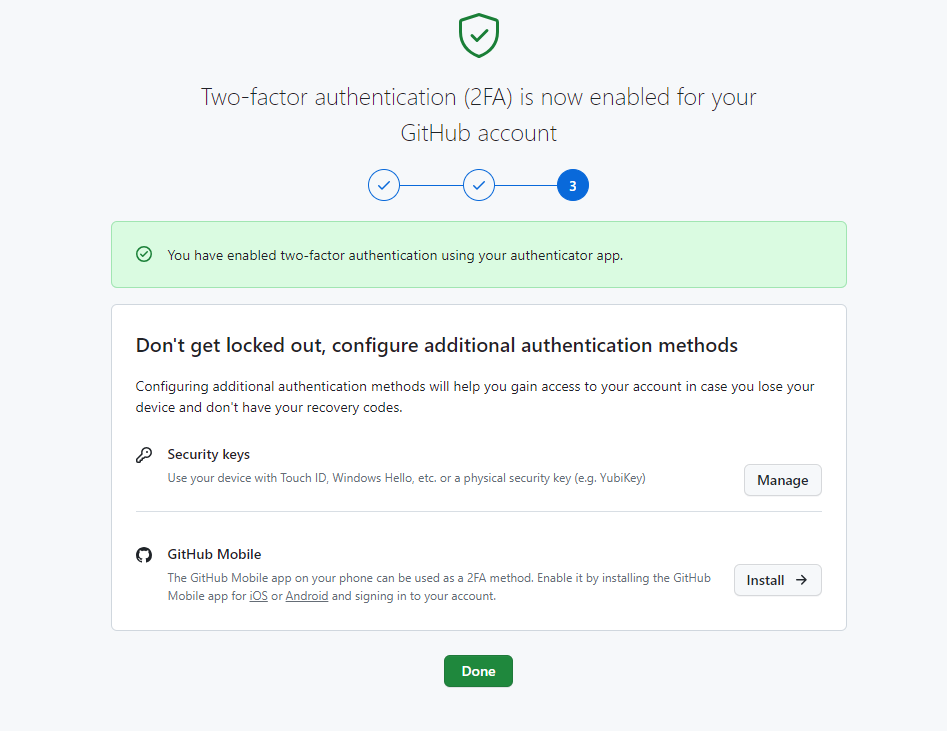

# 0.参考文档

> [中文参考文档](https://docs.github.com/zh/authentication/securing-your-account-with-two-factor-authentication-2fa/configuring-two-factor-authentication)

# 1. 使用 TOTP 移动应用程序配置双重身份验证(推荐)

## 1.1 下载TOTP相关的APP

> 我使用的是[Microsoft Authenticator](https://support.microsoft.com/zh-cn/account-billing/%E4%B8%8B%E8%BD%BD%E5%B9%B6%E5%AE%89%E8%A3%85microsoft-authenticator%E5%BA%94%E7%94%A8-351498fc-850a-45da-b7b6-27e523b8702a)
>
> - google play 商店下载 (有可能安装不了)
> - 使用手机应用商店下载, [参考地址](https://www.microsoft.com/zh-cn/security/mobile-authenticator-app?rtc=1)

## 1.2 配置

> - github开起2FA `Setting -> Password and authentication -> Enable two-factor authentication`,
>   
> - 设置验证器应用(我这里是 Authenticator), 直接扫描二维码获取6位数验证码
>
>   
> - 保存恢复码,  在输入6位code后会自动进入该界面, 手动下载恢复码并保存到"安全的地方",恢复代码可以帮助您回到帐户
>
>   
> - 保存恢复码后, 点击按钮 `I have saved my recovery codes`完成配置
>
>   

# 2.使用短信配置双重身份验证

> 别想了, 不支持中国手机号, 没找到办法, [支持 SMS 身份验证的国家/地区](https://docs.github.com/zh/authentication/securing-your-account-with-two-factor-authentication-2fa/countries-where-sms-authentication-is-supported)
