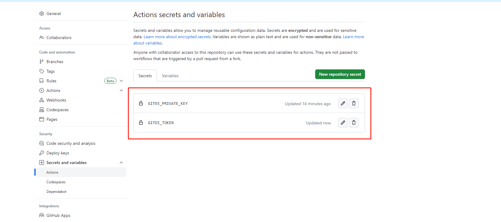
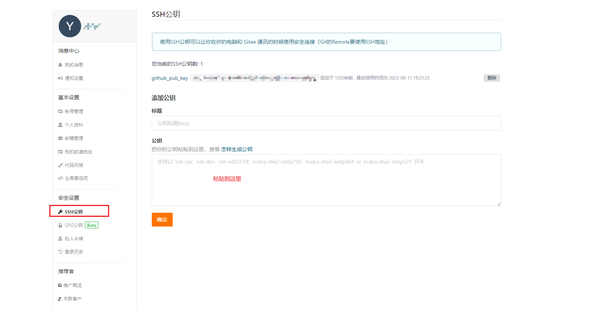

##### 1.1 secret

###### 1.1.1 github secret

###### 1.1.1.1 复制secret

> ~~菜单地址 `setting->Developer Settings->Personal access tokens->tokens(classic)->Generate new token (classic) 这个方式不行`~~
>
> 复制id_rsa里面的内容 `cat ~/.ssh/id_rsa`, 然后设置到1.1.1.2的步骤中

###### 1.1.1.2 设置secret

> 菜单地址 `[github仓库]->Settings->Secrets and variables->Actions->New repository secrets`
>
> 名称设置为 `GITEE_PRIVATE_KEY `
>
> 

###### 1.1.2 gitee secret

###### 1.1.2.1 生成secret

> 生成地址[https://gitee.com/profile/personal_access_tokens](https://gitee.com/profile/personal_access_tokens)

###### 1.1.2.2 设置secret

> 菜单地址 `[github仓库]->Settings->Secrets and variables->Actions->New Secrets`
>
> 名称设置为 `GITEE_TOKEN`

##### 1.3 创建 `workflows`

> - 创建路径 `.github/workflows`
> - 新建 `syncToGitee.yml`文件
>   ```yml
>   name: sync2Gitee
>   on:
>     push:
>       branches:
>         - main
>   jobs:
>     repo-sync:
>       runs-on: ubuntu-latest
>       steps:
>         - name: Mirror the Github organization repos to Gitee.
>           uses: Yikun/hub-mirror-action@master
>           with:
>             # 表示需要被同步的源端账户名，即我们 Github 的账户名
>             src: 'github/lylyuanliang'
>             # 表示需要同步到的目的端账户名，即我们 Gitee 的账户名
>             dst: 'gitee/yybun'
>             # 表示用于在目的端上传代码的私钥，然后将其保存在 Secrets 中
>             dst_key: ${{ secrets.GITEE_PRIVATE_KEY }}
>             # 表示gitee token，然后将其保存在 Secrets 中 
>             dst_token: ${{ secrets.GITEE_TOKEN }}
>             # 表示单一仓库同步
>             static_list: "note_cloud"
>             # force_update 为 true 表示启用 git push -f 强制同步 
>             force_update: true
>             # debug 为 true 表示启用 debug 开关，会显示所有执行命令 
>             debug: true
>   ```

#### 可能遇到的问题

##### stderr: 'git@gitee.com: Permission denied (publickey)

> 解决办法: 在gitee中添加公钥
>
> 1. `cat ~/.ssh/id_rsa.pub`拷贝公钥
> 2. gitee设置公钥(设置地址[https://gitee.com/profile/sshkeys](https://gitee.com/profile/sshkeys))
>
>    

