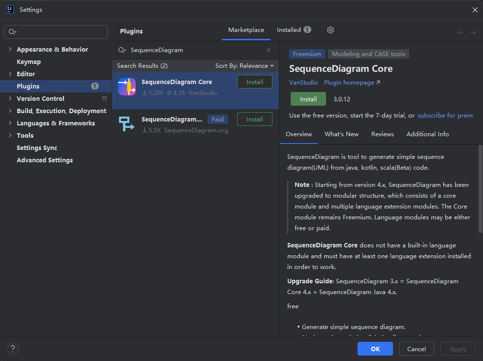
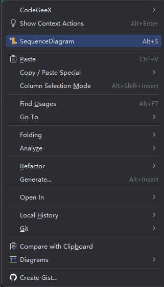
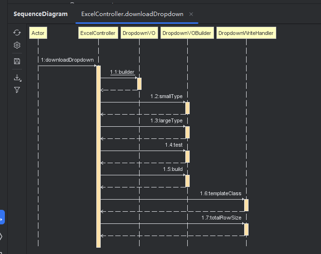

## 简介

SequenceDiagram是从java、kotlin、scala（Beta）和groovy（limited）代码生成简单序列图（UML）的工具。

## 安装

进入设置 **File > Settings > Plugins > Marketplace** . 搜索 SequenceDiagram，点击右边 Install 安装，然后重启 IDEA 。

## 插件使用(简要说明)

方法名右键 (也可以选择类名右键, 这时候会出现一个方法列表供你选择)

