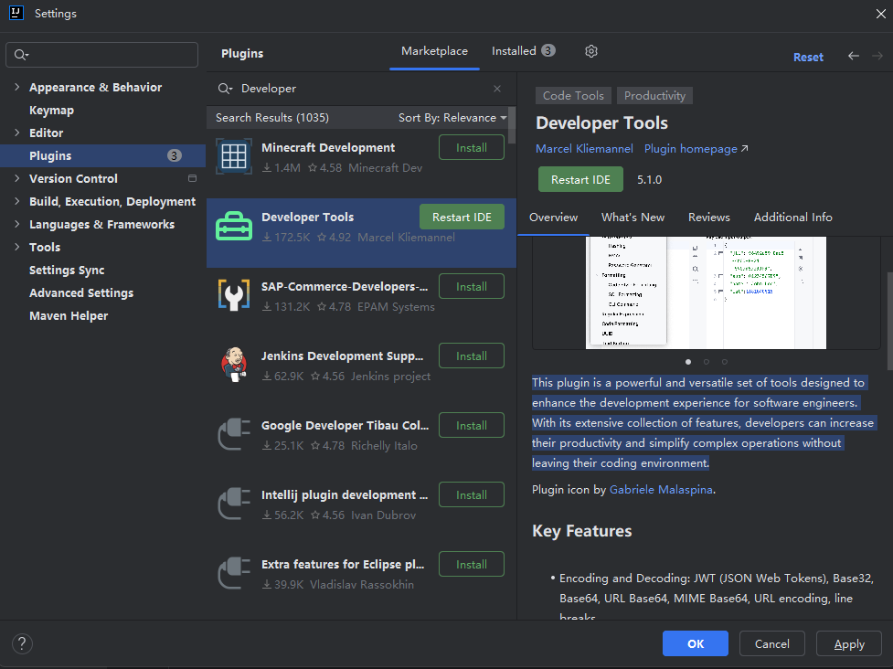
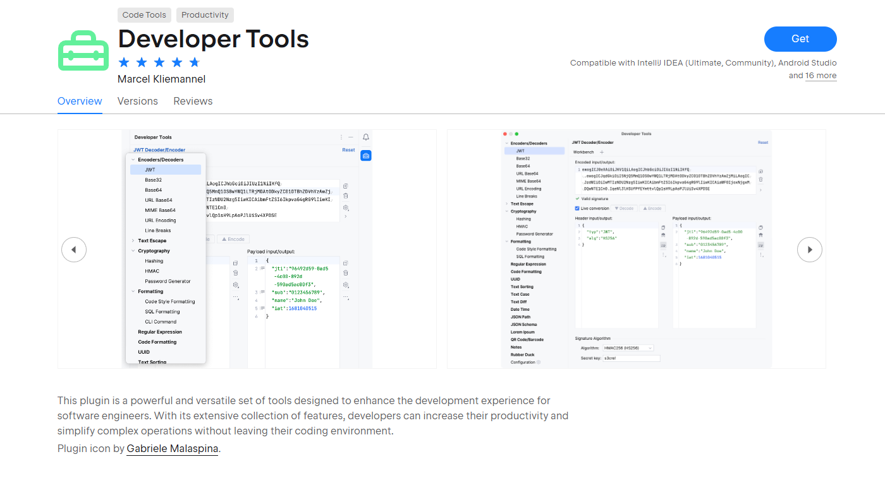
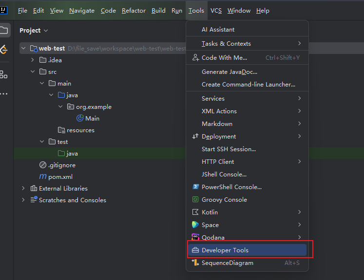
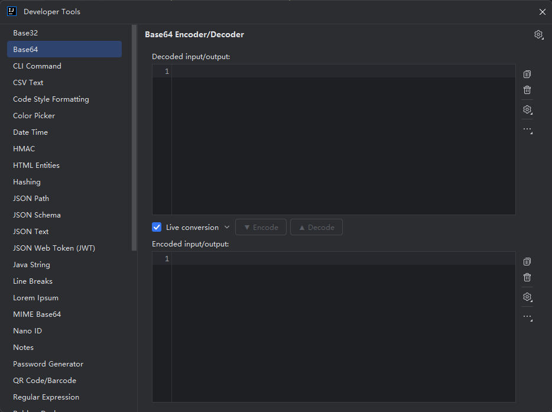

### 简介

该插件是一套功能强大且用途广泛的工具，旨在增强软件工程师的开发体验。借助其丰富的功能，开发人员无需离开编码环境即可提高工作效率并简化复杂操作。

### 安装

进入设置 **File > Settings > Plugins > Marketplace** . 搜索 Developer Tools，点击右边 Install 安装，然后重启 IDEA 。

或者使用离线装, [插件地址](https://plugins.jetbrains.com/plugin/21904-developer-tools)

### 插件使用(简要说明)

