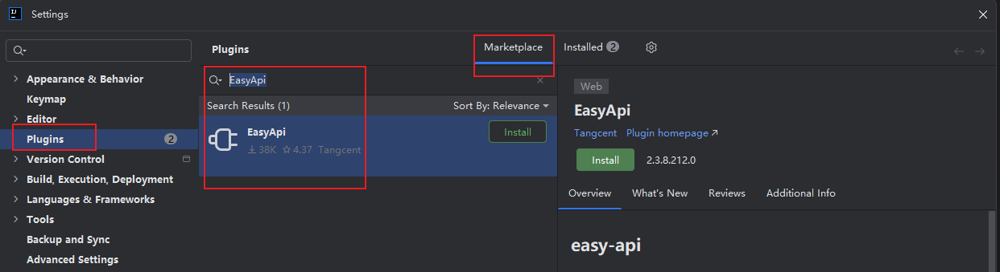

### 官网说明

[官网说明](https://easyyapi.com/documents/index.html)

### 插件安装

插件市场搜索 EasyApi

#### 离线安装

打开idea插件市场web页搜索 EasyApi,  参考[离线安装插件](../1.离线安装插件.md)

#### idea内插件市场

### 插件配置

[官网配置说明](https://easyyapi.com/setting/yapi.html), 其他自定义配置待补充
