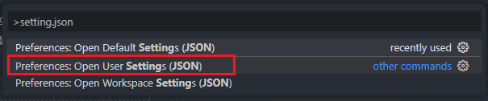
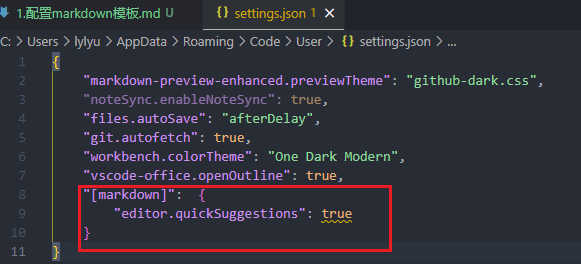
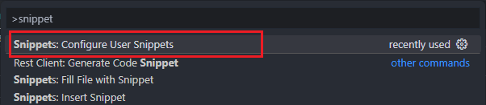
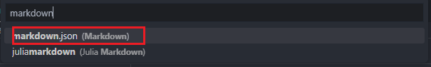
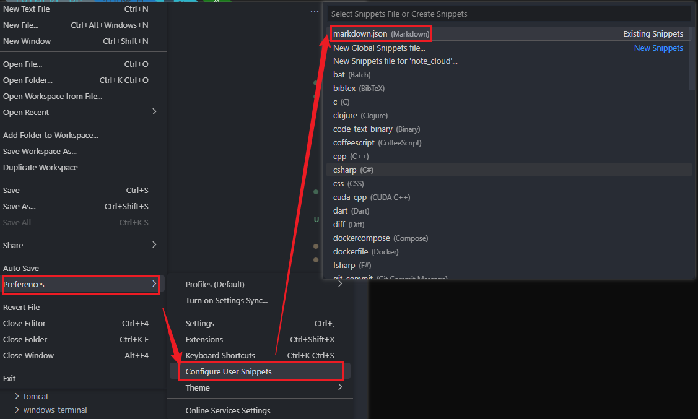
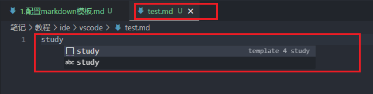

# 1. 打开 `setting.json`文件

> - 按下 `Ctrl + Shift + P` 或者 `Cmd + Shift + P` 打开命令面板，输入“settings.json”并选择“打开用户设置（JSON）”即可打开该文件
>   

# 2. 添加配置

> ```js
> "[markdown]":  {
>     "editor.quickSuggestions": true
> }
> ```
>
> 

# 3. 配置模板

> 1. 按下 `Ctrl + Shift + P` 或者 `Cmd + Shift + P` 打开命令面板输入 `snippet`
> 2. 点击 `首选项：配置用户代码片片段` ( `Snippets: Configure user Snippets` )
>
>    
> 3. 选择 `markdown.json`
>
>    
>
>    (**注**: 也可以 `文件->首选项 -> 用户片段`  (`file->Preferences->Configure User Snippets`)然后选择 `markown.json`)
>    

# 4. 编辑模板

> 在body中编写模板内容,完整样例如下
>
> ```json
> {
> 	// Place your snippets for markdown here. Each snippet is defined under a snippet name and has a prefix, body and 
> 	// description. The prefix is what is used to trigger the snippet and the body will be expanded and inserted. Possible variables are:
> 	// $1, $2 for tab stops, $0 for the final cursor position, and ${1:label}, ${2:another} for placeholders. Placeholders with the 
> 	// same ids are connected.
> 	// Example:
> 	"template 4 study": {
> 		"prefix": "study",
> 		"body": [
> 			"# 文档地址",
> 			"",
> 			"# 简介",
> 			"",
> 			"# 怎么用",
> 			"",
> 			"# 常见问题"
> 		],
> 		"description": "一个简单的markdown模板"
> 	}
> }
> ```

# 5. 使用

> 在md文件中输入 `study`即可(即模板中 `prefix`配置的名称)
>
> 
