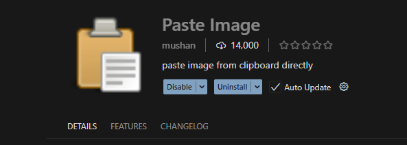
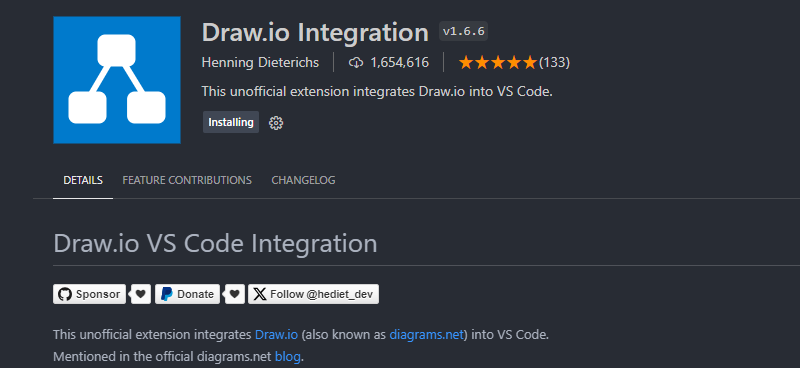

# 常用插件

## 1.Office Viewer(Markdown Editor)

 实现了对markdown的所见即所得编辑(该插件作者已停止维护), 替代方案如下

新环境可以优先考虑 Markdown Preview Enhanced、Markdown All in One、Paste Image 等替代组合。

## 1.1 md文档编辑辅助插件

### 1.1.3 Markdown Preview Enhanced

预览辅助


### 1.1.2 Markdown All in One

编辑辅助


### 1.1.3 Paste Image

图片快捷粘贴



相关设置
在 VS Code 中按下快捷键 Ctrl + Shift + P (Mac 用户按 Cmd + Shift + P)。
在弹出的输入框中输入：Preferences: Open User Settings (JSON)（打开用户设置）。
选中并回车打开这个 settings.json 文件。

```json

"pasteImage.path": "${currentFileDir}/image"

```

粘贴快捷键为ctrl+atl+v

## 2.Note Sync

> 笔记同步

## 3.**vscode-mindmap**

> 脑图插件, 作者是souche

## 4.Draw.io

可以用来画E-R图, 流程图等


