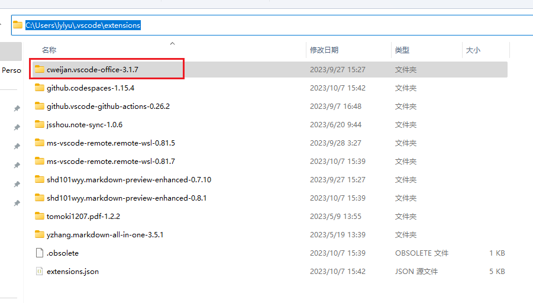
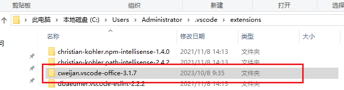
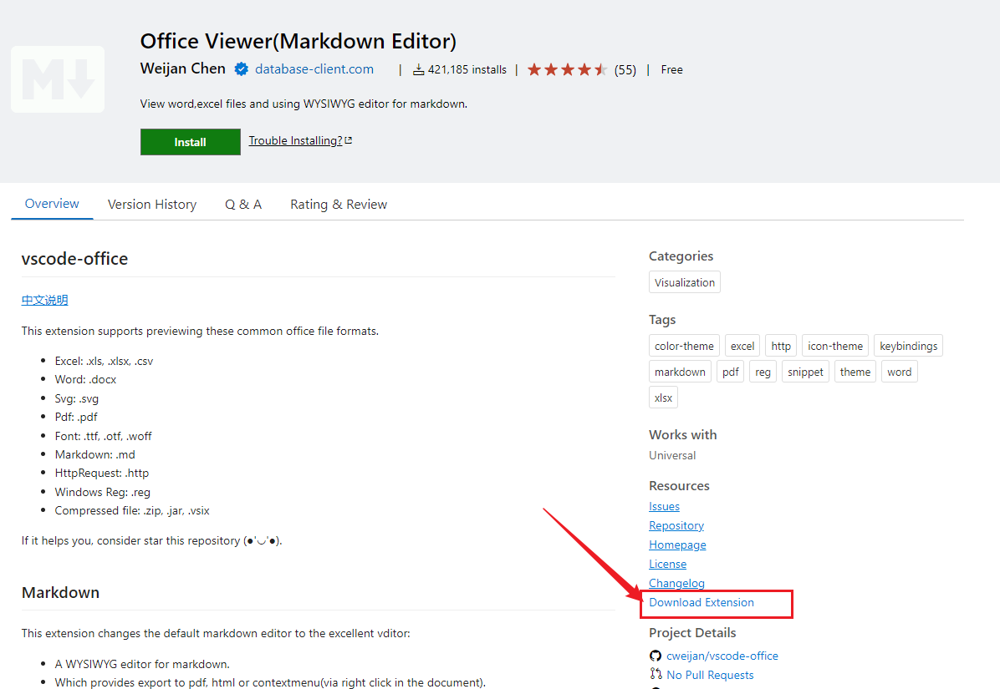
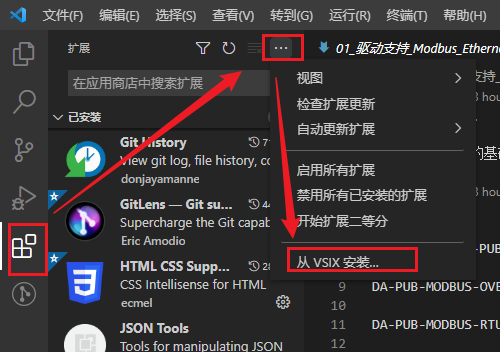

# 0.前置说明

> 以下内容以插件 `Office Viewer(Markdown Editor)`为例

# 1. 离线安装插件

## 1.1 方式一: 插件移植

> ***注意: 此方法我没有成功, 暂未找到原因, 可能与 `extensions.json`文件有关, 此处仅做记录, 建议按照[方式二](#12-方式二-官网下载安装包)进行离线安装***

### 1.1.1 插件下载

> 在已联网电脑上使用vscode安装插件
>
> 

### 1.1.2 插件复制

> 找到插件的安装位置, 一般为 `C:\用户\用户名\.vscode\extensions`
>
> 

### 1.1.3 目标电脑安装插件

> 将[1.1.2](#112-插件复制)中的对应的文件夹复制到目标电脑对应的路径下, 一般为 `C:\用户\用户名\.vscode\extensions`, 然后重启电脑即可
>
> 

## 1.2 方式二: 官网下载安装包

### 1.2.1 插件下载

> 在[vsocde官网](https://marketplace.visualstudio.com/vscode)搜索插件名称进行下载
>
> 

### 1.2.2 目标电脑插件安装

> - 将下载的 `.vsix`文件拷贝至目标电脑
> - 打开目标电脑vscode进行安装
> - 
> -
