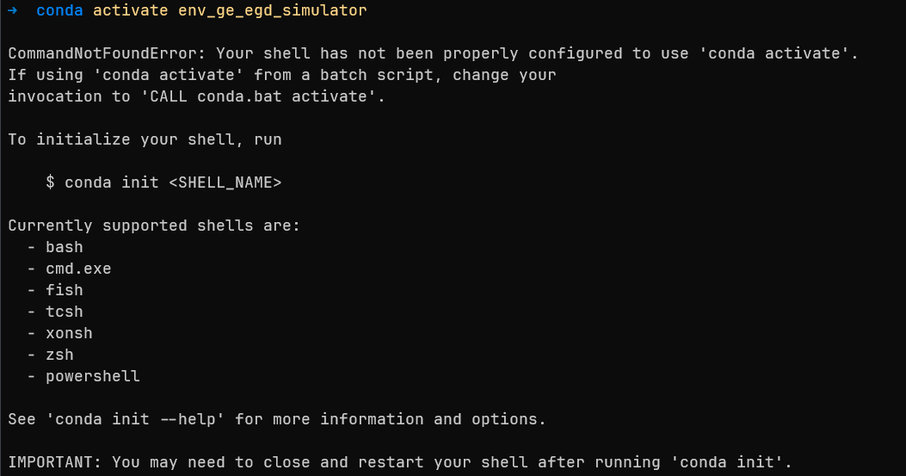

# 1. Conda安装

## 1.1 下载地址

> [anaconda官网下载](https://www.anaconda.com/download/#windows)

## 1.2 安装说明

> [官网说明]()

## 1.3 环境配置

### 1.3.1 部分常用命令说明

| 命令                                               | 用途及说明                                                                                                                     |
| -------------------------------------------------- | ------------------------------------------------------------------------------------------------------------------------------ |
| `conda --version`                                | 查看conda版本号                                                                                                                |
| `conda create --name your_env_name [python=3.4]` | 新建环境,`your_env_name`替换成环境名称, 也可以指定python版本                                                                 |
| `conda activate your_env_name`                   | 激活环境                                                                                                                       |
| `conda info -e` 或则 `conda env list`          | 查看所有创建的环境                                                                                                             |
| `conda remove --name env_name –all`             | 删除环境                                                                                                                       |
| `conda install package_name`                     | 在当前环境中安装包                                                                                                             |
| `conda config --add channels ...`                | 添加镜像channel<br />例如清华源<br /> `conda config --add channels https://mirrors.tuna.tsinghua.edu.cn/anaconda/pkgs/main` |
| `conda config --remove channels ....`            | 删除镜像channel                                                                                                                |
| `conda config --show channels`                   | 展示目前已有的镜像channel                                                                                                      |
| `conda config --set show_channel_urls yes`       | 显示conda当前下载是在用哪一个                                                                                                  |
| `conda config --remove-key channels`             | 删除所有下载源                                                                                                                 |

### 1.3.2 设置镜像源

```python
# 清华源,使用conda config --show channels查看所有的channels
conda config --add channels  https://mirrors.tuna.tsinghua.edu.cn/anaconda/pkgs/main
conda config --set show_channel_urls yes
```

### 1.3.3 创建环境

```python
conda create -n env_ge_egd_simulator python=3.6
```

# 2. python

## 2.1 安装

> 见[1.3.3创建环境](#133-创建环境), 使用conda进行python的安装

## 2.2 常用命令记录

| 命令                 | 说明           |
| -------------------- | -------------- |
| `python --version` | 查看python版本 |
|                      |                |

# 可能遇到的问题

## 1) CommandNotFoundError: Your shell has not been properly configured to use 'conda activate'



> 解决办法:
>
> 执行 `conda init`
