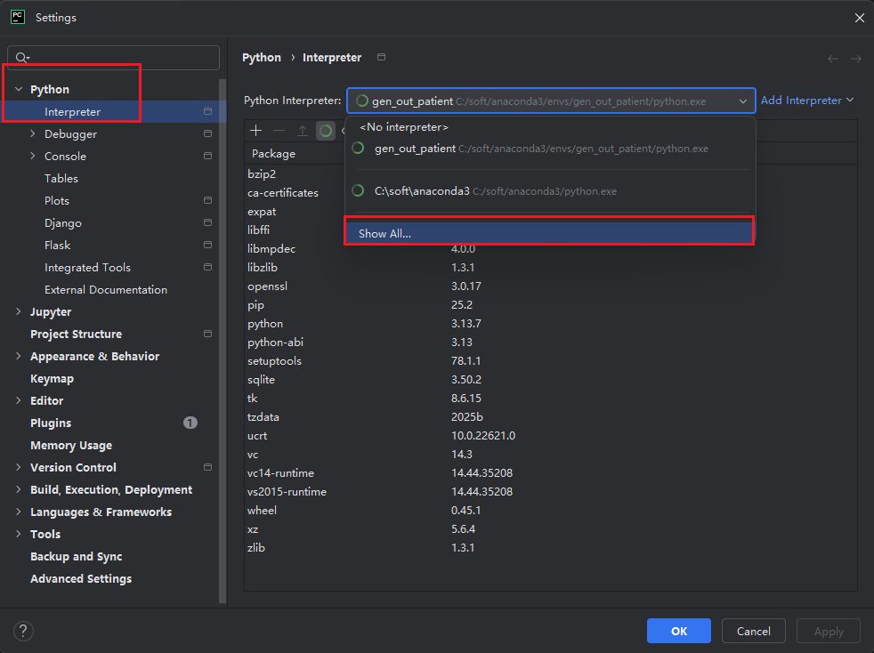
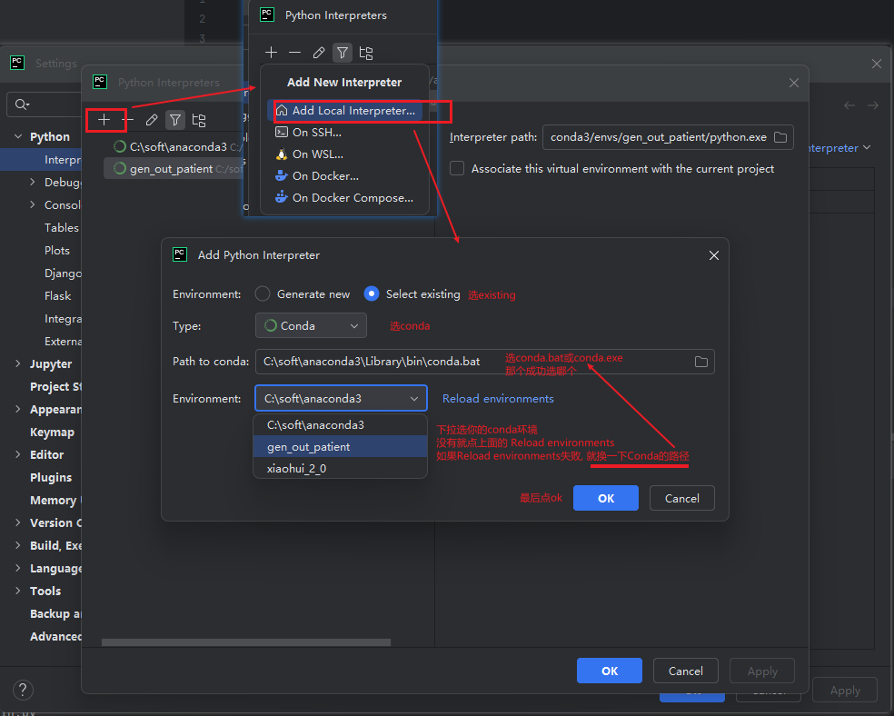
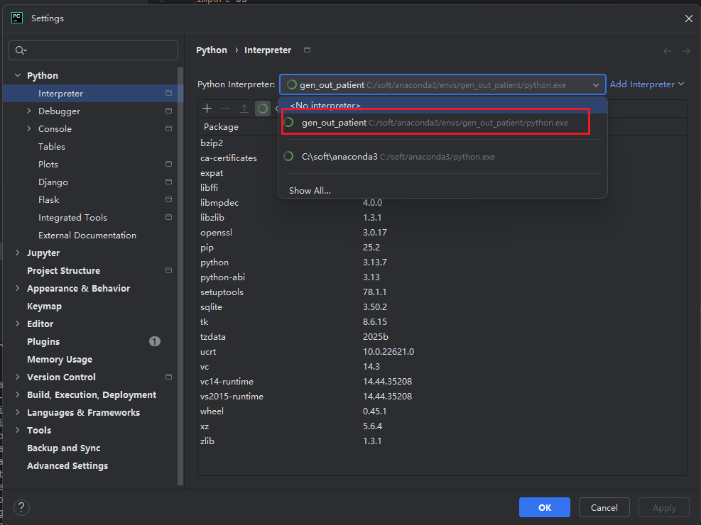

## conda安装

见[python环境搭建](./1.python环境搭建.md)

## pycharm绑定conda环境

### pycharm版本信息

PyCharm 2025.2.1.1

### 绑定conda

#### 创建解释器

ctrl+shift+s打开设置



添加解释器



选择刚刚添加的conda环境



#### 安装依赖包(可选)

对于已有项目, 如果你有 有 `requirements.txt`, 则执行下吗的命令(或其他方法, 自行搜索)

```powershell
pip install -r requirements.txt
```
