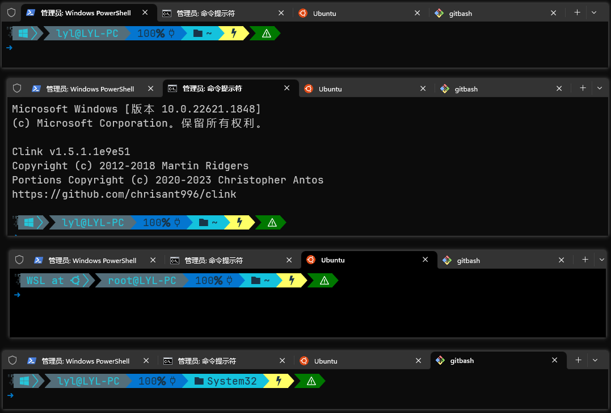
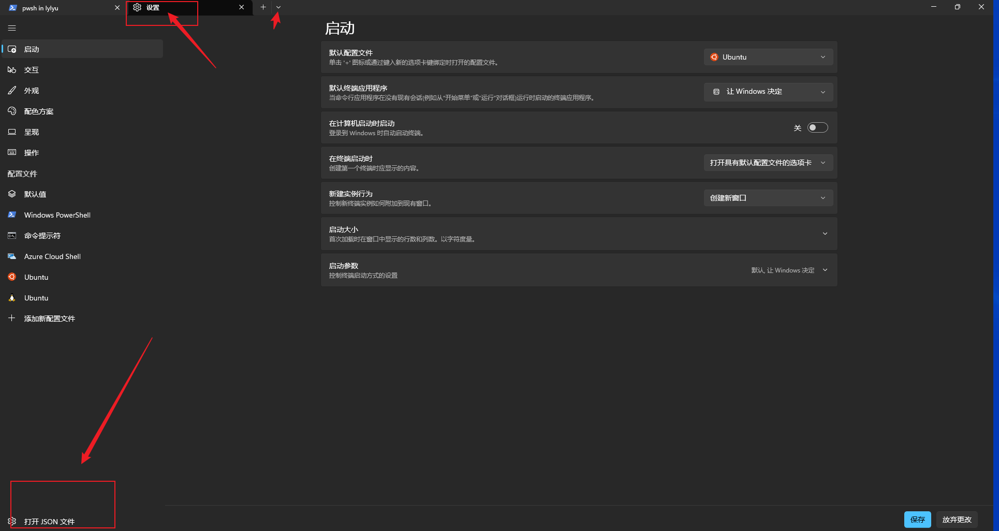

# 图片如果不能访问, 参照[github图片访问问题](../github/1.github%E8%AE%BF%E9%97%AE%E7%9B%B8%E5%85%B3.md#1-github图片不能访问的问题)

# 1 下载和安装

> 方式一:[ github地址](https://github.com/microsoft/terminal)
>
> 方式二: 微软商店搜索 `windows terminal`

# 2 美化(包括powershell, cmd, wsl, gitbash)

> wsl的美化是独立的,  如果是美化wsl, **2.1**可以跳过
>
> 先放一张效果图
>
> 

## 2.1 [oh-my-posh安装](2.oh-my-posh%E5%AE%89%E8%A3%85.md)

## 2.2 字体设置

> 字体安装见 **2.1 oh-my-posh安装**

> 修改 windows terminal 配置文件 (设置->底部"打开JSON文件")
>
> 
>
> 将 `2.1 oh-my-posh安装`中安装的字体配置到setting文件中, (当天, 也可以直接在windows-terminal设置界面中镜像设置)
>
> ```json
> {
> "profiles": {
>  "defaults": {
>   "experimental.retroTerminalEffect": false,
>   "font": {
>    "face": "JetBrainsMono Nerd Font",
>    "size": 14
>   }
>  },
> }
> }
> ```
>
> `defaults`: 终端的默认值配置
>
> `experimental.retroTerminalEffect`: 复古风格的终端效果

## 2.3 美化powershell

> 见[powershell美化](./3.powershell%E7%BE%8E%E5%8C%96.md)

## 2.4 美化CMD

> 见[cmd美化](./4.cmd%E7%BE%8E%E5%8C%96.md)

## 2.5 美化WSL

> 见[wsl美化](./5.wsl%E7%BE%8E%E5%8C%96.md), wsl安装教程见[wsl安装](../wsl/1.wsl.md)

## 2.6 美化GIT BASH

> 见[gitbash美化](./6.gitbash%E7%BE%8E%E5%8C%96.md)

# 可能遇到的问题
