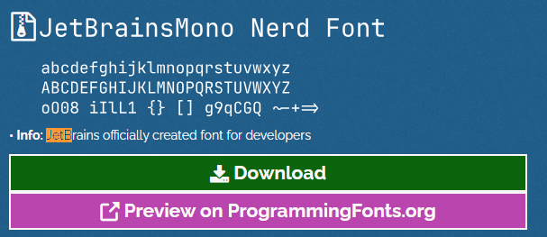

# oh-my-posh

[官网地址](https://ohmyposh.dev/docs/installation/windows)

## 1 准备工作

### 1.1 powershell执行策略修改

> **命令说明**
>
> | 命令                          | 说明                                                                                                                                                                                                                                                                                                                                                                                                                                                                                               |
> | ----------------------------- | -------------------------------------------------------------------------------------------------------------------------------------------------------------------------------------------------------------------------------------------------------------------------------------------------------------------------------------------------------------------------------------------------------------------------------------------------------------------------------------------------- |
> | **get-ExecutionPolicy** | 获取 Windows PowerShell 当前执行策略                                                                                                                                                                                                                                                                                                                                                                                                                                                               |
> | **set-ExecutionPolicy** | 修改 Windows PowerShell 中执行策略, 管理员运行<br />- **Restricted**,默认值, 表示状态是禁止的 不载入配置文件, 不执行脚本<br />- **RemoteSigned**,所有从互联网上下载的脚本必须通过信任的出版商签名<br />- **AllSigned**,所有的配置文件和脚本必须通过信任的出版商签名(trusted publisher)，这里所指的脚本页包括在本地计算机上创建的脚本<br />- **Unrestricted**, 载入所有的配置文件和脚本，如果运行了一个从互联网上下载且没有数字签名的脚本，在执行前都会被提示是否执行 |

> **执行修改**
>
> ```powershell
> # 获取 Windows PowerShell 当前执行策略
> get-ExecutionPolicy
>
> # 修改 Windows PowerShell 中执行策略
> set-ExecutionPolicy RemoteSigned
> ```

### 1.2 winget

> 本文使用winget来安装, 其他安装方式请参考[oh-my-posh官网](https://ohmyposh.dev/docs/installation/windows),
>
> 如果没有可以网上查一下怎么安装 `winget`, win11自带winget,  [winget官方网址](https://learn.microsoft.com/zh-cn/windows/package-manager/winget/)

## 2.安装oh-my-posh

```powershell
# oh-my-posh 安装命令, --location表示安装目录
winget install JanDeDobbeleer.OhMyPosh -s winget --location D:\software\OhMyPosh

# oh-my-posh 更新命令,  --location表示安装目录
winget upgrade JanDeDobbeleer.OhMyPosh -s winget --location D:\software\OhMyPosh
```

## 3.安装字体

> 因为默认字体对主题很多符号的支持不是很好, 所以安装官方推荐的字体, 安装方式有以下两种("命令"或"官网下载")

> 方式一: 命令安装, 官方也只是beta版本, 这种方式可能会失败, 建议使用第二中方式
>
> ```powershell
>
> # 执行以下命令后选择字体进行安装 
>
> oh-my-posh font install
>
> ```

> 方式二: 打开官网地址下载安装 [https://www.nerdfonts.com/font-downloads](https://www.nerdfonts.com/font-downloads), 我使用的是 `JetBrainsMono Nerd Font`字体
>
> 

# 可能遇到的问题
