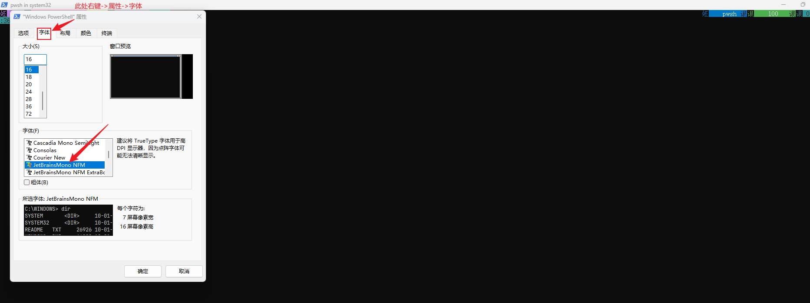

# powershell美化

## 1 补充说明说明1-windows环境变量, 可直接在powershell终端界面输入查看对应的变量值

| 变量名                          | 变量说明                          |
| ------------------------------- | --------------------------------- |
| $HOME                           | 用户的主目录                      |
| $PSHOME                         | PowerShell 安装目录               |
| $PROFILE                        | 当前用户、当前主机 配置文件的路径 |
| $PROFILE.CurrentUserCurrentHost | 当前用户、当前主机 配置文件的路径 |
| $PROFILE.CurrentUserAllHosts    | 当前用户，所有主机 配置文件的路径 |
| $PROFILE.AllUsersCurrentHost    | 所有用户，当前主机 配置文件的路径 |
| $PROFILE.AllUsersAllHosts       | 所有用户、所有主机 配置文件的路径 |

## 2 安装oh-my-posh

> 参考[oh-my-posh安装](2.oh-my-posh%E5%AE%89%E8%A3%85.md) , 如果已经安装, 请忽略

## 3 powershell配置文件

### 3.1 创建配置文件

```powershell
# 查看当前是否存在 PowerShell 配置文件
# False 不存在配置文件
# True  存在配置文件
Test-Path $PROFILE

# 如果Test-Path $PROFILE 返回False, 则执行下面的命令
# 创建一个 PowerShell 配置文件
New-Item -Path $PROFILE -Type File -Force
```

### 3.2 编辑配置文件

> 配置文件路径可以通过在 `powershell`终端输入 `$PROFILE`来查看

#### 3.2.1 添加快捷打开函数(可选)

```powershell
# Microsoft.PowerShell_profile.ps1

# 使用 vscode 打开 $PROFILE 配置文件,  
# 在powershell终端里面输入vscodeOpen , 即可快捷打开配置文件
function vscodeOpen {
 Code $PROFILE
}

# 使用 nodepad++ 打开 $PROFILE 配置文件
# 在powershell终端里面输入notepadOpen , 即可快捷打开配置文件
function notepadOpen {
 noetepad $PROFILE
}
```

#### 3.2.2 oh-my-posh 主题定制化配置

> [官网主题定制化说明](https://ohmyposh.dev/docs/installation/customize)   [oh-my-posh 主题官网说明](https://ohmyposh.dev/docs/themes)

> 主要配置如下
>
> ```powershell
> # $PROFILE 配置文件路径
> # C:\Users\sunsb\Documents\WindowsPowerShell\Microsoft.PowerShell_profile.ps1
>
> # 配置 oh-my-posh 主题方式一
> # 所有的本地主题文件都在 oh-my-posh安装目录/themes 目录下，以 .json 结尾,     oh-my-posh安装见 2.0 安装oh-my-posh
> # oh-my-posh init pwsh --config 'D:/software/OhMyPosh/themes/jandedobbeleer.omp.json' | Invoke-Expression
>
> # 配置 oh-my-posh 主题方式二，远程方式
> # oh-my-posh init pwsh --config 'https://raw.githubusercontent.com/JanDeDobbeleer/oh-my-posh/main/themes/jandedobbeleer.omp.json' | Invoke-Expression
>
> # 配置 oh-my-posh 主题方式三，当前我使用的
> # POSH_THEMES_PATH 是 oh-my-posh 的 用户环境变量
> oh-my-posh init pwsh --config "$env:POSH_THEMES_PATH/jandedobbeleer.omp.json" | Invoke-Expression
>
> # 导出 oh-my-posh 主题
> # oh-my-posh config export --output D:/jandedobbeleer.omp.json
> ```

### 3.3 完整配置文件示例

> ```powershell
> # Microsoft.PowerShell_profile.ps1
>
> # 去除 Window PowerShell 版权所有提示
> clear
>
> # 使用 vscode 打开 $PROFILE 配置文件
> function vscodeOpen {
>  Code $PROFILE
> }
>
> # 使用 nodepad++ 打开 $PROFILE 配置文件
> function notepadOpen {
>  noetepad $PROFILE
> }
>
> # $PROFILE 配置文件路径
> # C:\Users\sunsb\Documents\WindowsPowerShell\Microsoft.PowerShell_profile.ps1
>
> # 配置 oh-my-posh 主题方式一
> # 所有的本地主题文件都在 D:/OhMyPosh/themes 目录下，以 .json 结尾
> # oh-my-posh init pwsh --config 'D:/OhMyPosh/themes/jandedobbeleer.omp.json' | Invoke-Expression
>
> # 配置 oh-my-posh 主题方式二，远程方式
> # oh-my-posh init pwsh --config 'https://raw.githubusercontent.com/JanDeDobbeleer/oh-my-posh/main/themes/jandedobbeleer.omp.json' | Invoke-Expression
>
> # 配置 oh-my-posh 主题方式三，当前我使用的
> # POSH_THEMES_PATH 是 oh-m-posh 的 用户环境变量
> oh-my-posh init pwsh --config "$env:POSH_THEMES_PATH/jandedobbeleer.omp.json" | Invoke-Expression
>
> # 导出 oh-my-posh 主题
> # oh-my-posh config export --output D:/jandedobbeleer.omp.json
> ```

# 可能遇到的问题

#### 问题一: 管理员打开powershell(powershell32)乱码

> 临时解决(顶部右键->属性->字体)
>
> 
