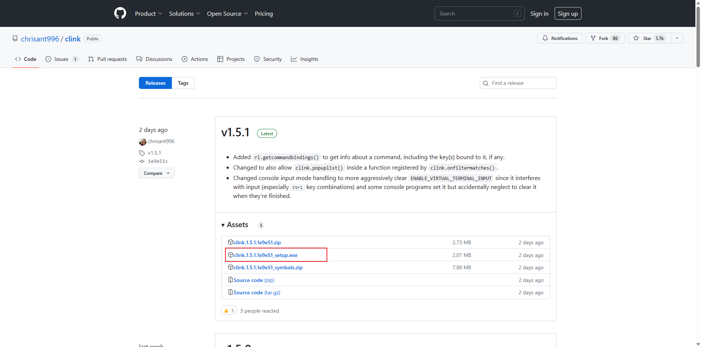
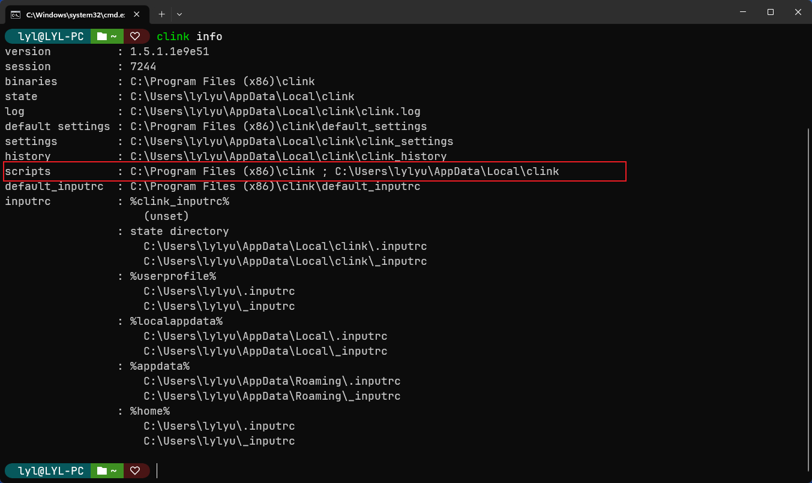

# CMD美化

## 1 安装oh-my-posh

> 参考[oh-my-posh安装](2.oh-my-posh%E5%AE%89%E8%A3%85.md) , 如果已经安装, 请忽略

## 2 安装clink

> cmd本身是不支持美化的, 所以需要借助 `clink`来实现美化,  [clink官网](https://chrisant996.github.io/clink/)
>
> [clink官方下载地址](https://github.com/chrisant996/clink/releases)
>
> 

## 3 配置

### 3.1 查看配置文件位置

> ```powershell
> # 使用命令 clink info, 查看scripts的路径
> clink info
> ```
>
> 

### 3.2 修改配置

> 打开*3.1*中 `srcipts`路径, 然后在路径下新建 `on-my-posh.lua,`输入以下内容
>
> ```lua
> -- 也有三种方式进行配置
> -- 1. 绝对路径 load(io.popen('oh-my-posh --config="D:/software/OhMyPosh/themes/blueish.omp.json" --init --shell cmd'):read("*a"))() , D:/software/OhMyPosh替换成自己的oh-my-posh安装目录
> -- 2. 环境变量设置 load(io.popen('oh-my-posh --config="%POSH_THEMES_PATH%/blueish.omp.json" --init --shell cmd'):read("*a"))(), 我使用的这种
> -- 3. 云路径 load(io.popen('oh-my-posh --config="https://raw.githubusercontent.com/JanDeDobbeleer/oh-my-posh/main/themes/blueish.omp.json" --init --shell cmd'):read("*a"))()  
> load(io.popen('oh-my-posh --config="%POSH_THEMES_PATH%/blueish.omp.json" --init --shell cmd'):read("*a"))()
> ```

# 可能遇到的问题
