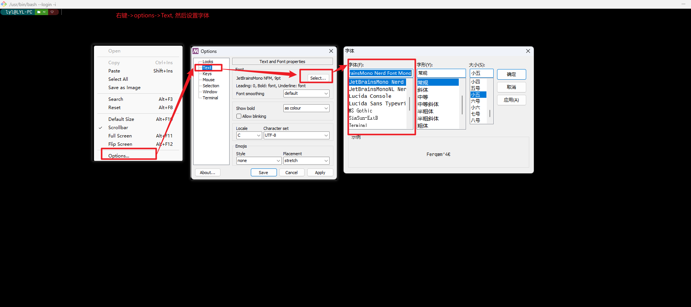

# Git bash美化

## 1 安装oh-my-posh

> 参考[oh-my-posh安装](2.oh-my-posh%E5%AE%89%E8%A3%85.md) , 如果已经安装, 请忽略

## 2 配置

> 编辑 `~/.bashrc` 或 `~/.prifile` 文件（没有就新建一个）, 以下以 `~/.bashrc`为例

> 直接 `vim ~/.bashrc`
>
> 或者通过 `pwd ~` 查看目录然后用文本编辑器编辑该目录下的对应文件

> 文件内容如下:
>
> ```bash
> # 三种方式
> #  1. 绝对路径 eval "$(oh-my-posh --init --shell bash --config 'D:/software/OhMyPosh/themes/cinnamon.omp.json')" , D:/software/OhMyPosh替换成自己的oh-my-posh安装目录
> #  2. 环境变量设置 eval "$(oh-my-posh --init --shell bash --config $POSH_THEMES_PATH'/cinnamon.omp.json')", 我使用的这种
> #  3. 云路径 eval "$(oh-my-posh --init --shell bash --config https://raw.githubusercontent.com/JanDeDobbeleer/oh-my-posh/v$(oh-my-posh --version)/themes/cinnamon.omp.json)" 
> eval "$(oh-my-posh --init --shell bash --config $POSH_THEMES_PATH'/cinnamon.omp.json')"
> ```

## 3. 字体设置

> 设置完主题后会发现, 有些符号乱码, 需要修改一下字体(字体安装见**1 安装oh-my-posh**)
>
> 

# 可能遇到的问题
