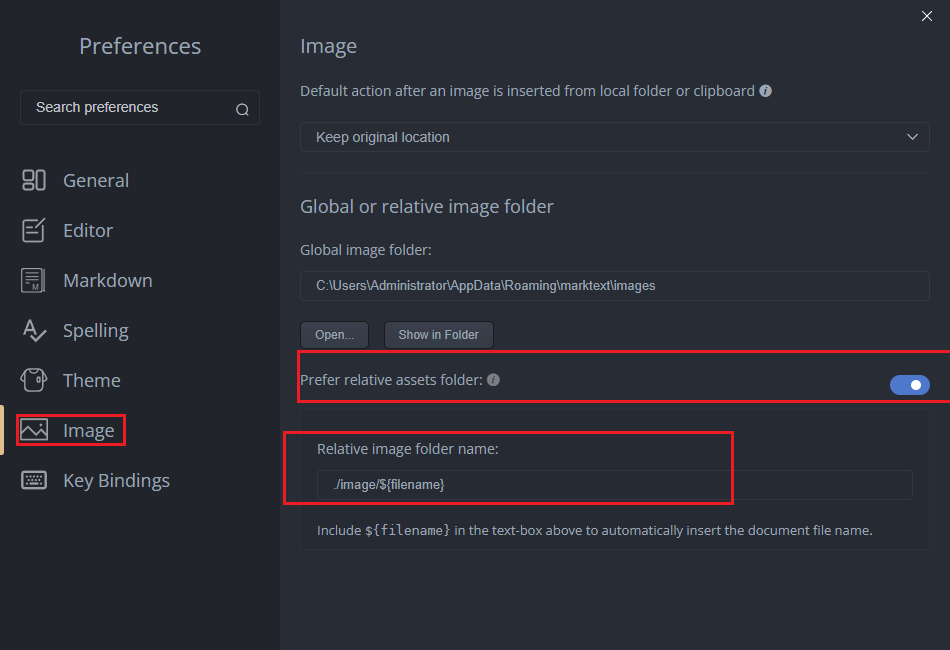

- docker desktop
- wsl2升级
- ubuntu
- jdk
- jetbrains产品(idea, webstrom, datagrip)
- listary
- Snipaste
- bandizip
- windows terminal
- 终端美化(cmd, powershell, ubuntu, git...)
- winget (win11自带)
- git
- geek
- vscode
- nodepad--
- clink
- chrome
- nvm
- marktext
  - 图片保存路径设置为 `./${fimename}`这种形式才能保存到和md文档同级目录, 否则会保存到根目录
    - 设置样例 `./image/${filename}`
    - 
- clash client
  - clash verge
- 影视仓
- 阅读(移动端)
- 其他
- todoList
  - 微软商店安装
- MusicFree
  - [win版](https://github.com/maotoumao/MusicFreeDesktop/releases)
  - [安卓](https://github.com/maotoumao/MusicFree/releases)
  - 
- LocalSend
  - [下载地址](https://localsend.org/zh-CN/download)
- AnyTXT Searcher
  - [下载地址]
