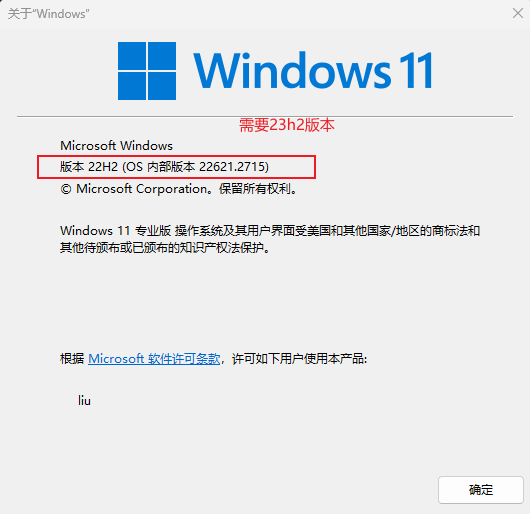
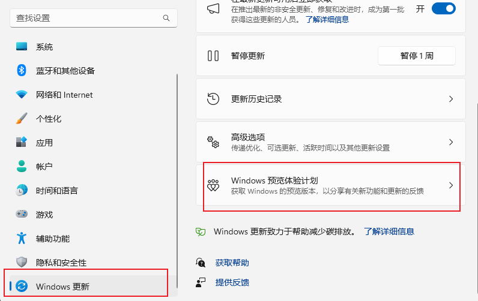
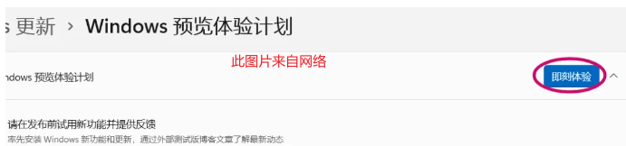
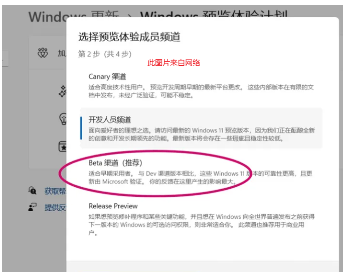

# 1.系统更新

## 1.1 查看系统版本

按下 `Win+R`键，输入 `WINVER`，确定。即可查看windows版本

## 1.2 更新推送

### 1.2.1 从互联网上下载镜像安装(比如github)

**未尝试,可自行百度**

### 1.2.2 加入体验计划然后更新

关联账户(如果没有就去注册), 在接下来的“选择预览体验成员频道”中选择“beta渠道”，之后重启电脑即可

