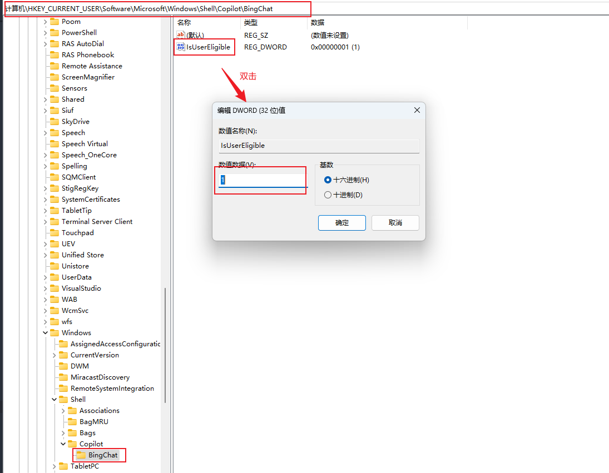
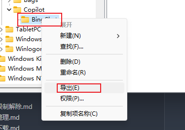
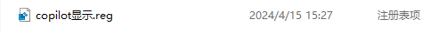
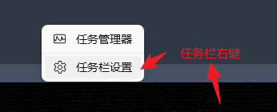
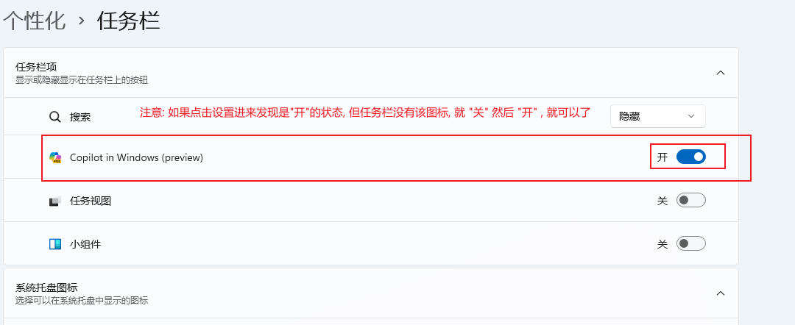

# 1.系统更新

## 1.1 查看系统版本

按下 `Win+R`键，输入 `WINVER`，确定。即可查看windows版本

## 1.2 更新推送

### 1.2.1 从互联网上下载镜像安装(比如github)

**未尝试,可自行百度**

### 1.2.2 加入体验计划然后更新

关联账户(如果没有就去注册), 在接下来的“选择预览体验成员频道”中选择“beta渠道”，之后重启电脑即可

# 2.copilot不显示

如果copilot不显示或某次更新后突然不显示了, 可以试试下面的方法

**方法一**: 修改注册表, `\HKEY_CURRENT_USER\Software\Microsoft\Windows\Shell\Copilot\BingChat\IsUserEligible`

1. 双击将 0 修改为 1

2. 导出注册表(**BingChat文件夹右键导出**), 方便下次修改(可选),   (这样做的目的是防止下次更新系统copilot又没了, 这个时候就只需要双击导出的注册表即可)

   

   
3. 修改任务栏设置

   

