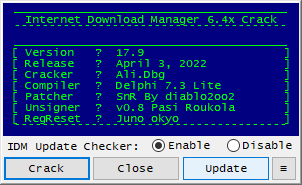
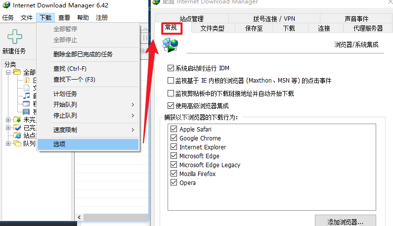
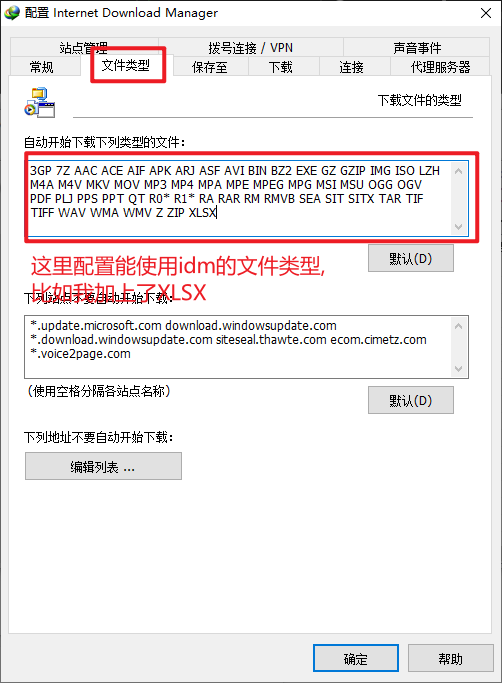

# 1.下载客户端

[官网地址](https://www.internetdownloadmanager.com/)

## 1.1 破解版

[位置](./安装包/idm/)

# 2.过程

# 1.1 安装

略.

## 1.2 处理(有条件还是支持官方正版)(仅做学习使用)

### 1.2.1 注册机crack

软件见 [1.1](#11-破解版)

点击 crack, 然后finish退出

## 1.2 配置

打开idm,  下载->选项->常规, 如果打上勾, 表示浏览器下载可以调用idm

如果有的下载没有启动idm, 可以看看文件类型这里的配置

