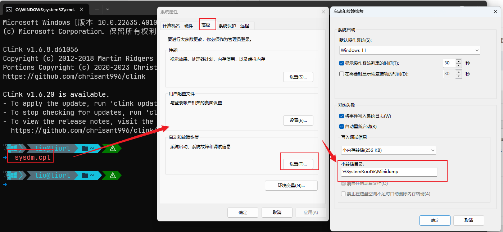
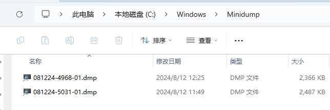
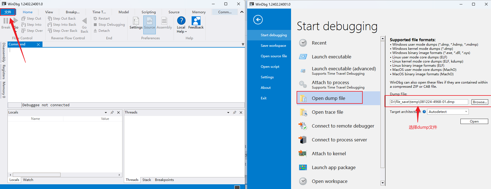
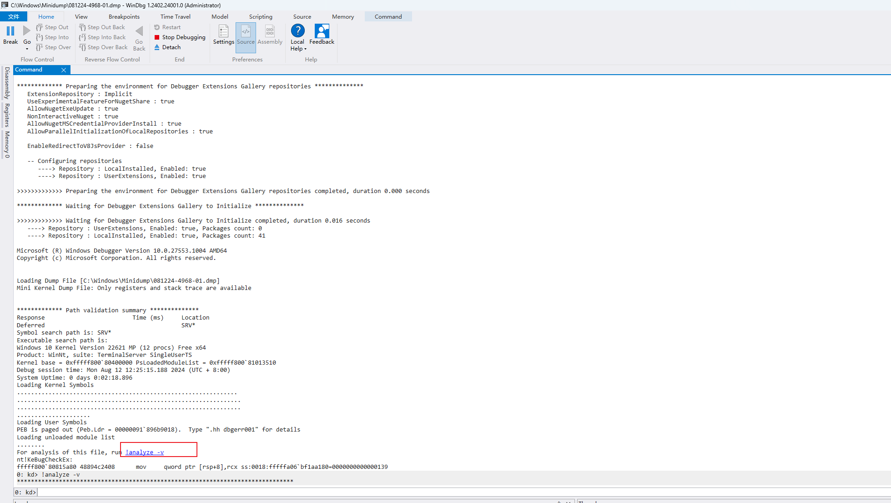
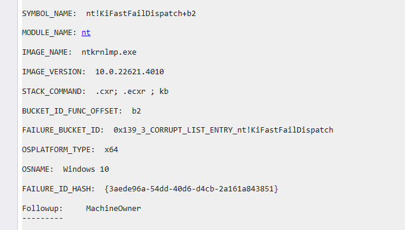
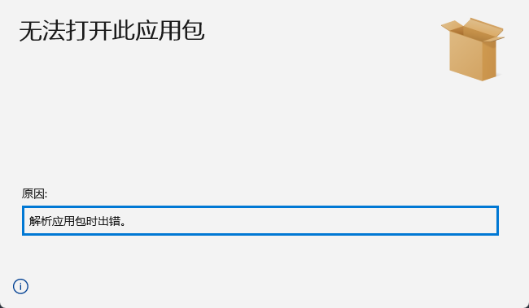
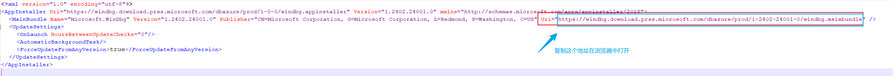
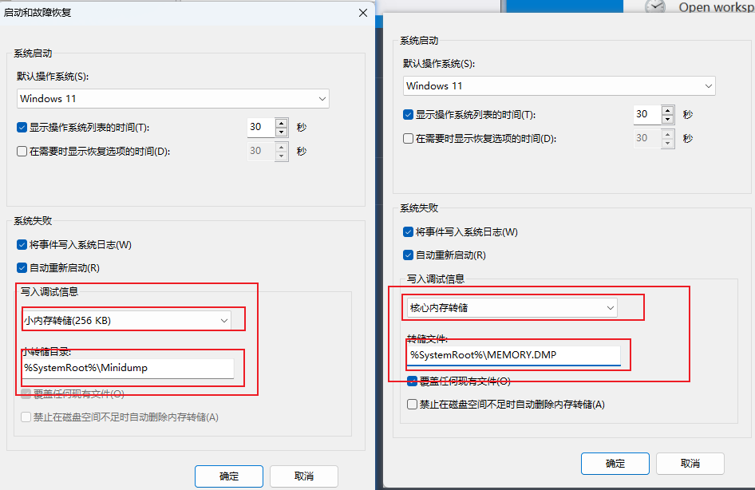

# 查找Dump文件位置

在cmd窗口运行 `sysdm.cpl`, 如下图, 找到 `%SystemRoot%`代表的路径就是dump文件存储路径

`%SystemRoot%`代表的是系统变量, 可以在环境变量中找到, 也可以直接在cmd中输入查看(输入 `echo %SystemRoot%`)

所以综上, 你就可以推测出你的dump文件所在位置了, 例如我的为 `C:\Windows\Minidump\`,下面的截图就是我两次蓝屏产生的dump文件 (PS: 也有可能在 `%SystemRoot%`目录下, 直接就是一个MEMERY.DMP文件, 主要看"写入调试信息选择"选择的啥)

**(PS: 当然了, 直接在资源管理中输入 %SystemRoot%\Minidump , 也只是可以打开相应的目录的)**

# 安装调试工具 Windbg

方式一:

[官方安装说明文档](https://learn.microsoft.com/zh-cn/windows-hardware/drivers/debugger/)

[官方下载地址](https://aka.ms/windbg/download)

我这里下载的是最新版本, 如果需要下载历史版本, 可在[官方安装说明文档](https://learn.microsoft.com/zh-cn/windows-hardware/drivers/debugger/)中找到下载地址

ps: 如果下载的 `windbg.appinstaller`程序安装失败, 见[windbg.appinstaller安装&#34;解析应用包时出错。&#34;](#windbgappinstaller安装解析应用包时出错)

方式二:

Microsoft Store中下载

# 进行调试

## 打开dump文件

如果没有权限, 就将dump文件复制出来, 或用管理员权限打开 Windbg  (快捷键Shift+F5来关闭上一个DMP的分析记录, 可以直接点击界面上 `Stop Debugging`按钮)

## 查看关键信息

- 加载完毕后，点击蓝色下划线的 **! analyze -v** ，之后继续等待最下方进度条加载完毕消失
- 加载完毕之后，最下方，即为分析出的蓝屏的错误信息
- 查看分析 MODULE_NAME 或 IMAGE_NAME 。对结果进行查看将决定进一步的故障处理步骤，并可能揭示错误的原因。

# winDbg常用命令

- !analysis -v 立即查看哪个程序导致的崩溃
- !process 确定哪个程序引起的

# 可能遇到的问题

## windbg.appinstaller安装"解析应用包时出错。"

按照以下步骤进行解决

- 找到下载的 `windbg.appinstaller`文件
- 用记事本打开该文件, 并找到 `Uri`对应的地址, 然后在浏览器中打开

## Dump文件默认路径问题 (自己修改路径除外)

根据"写入调试信息"的选择略有不同, 详见下图

