#### 1. 简介

> 适用于 Linux 的 Windows 子系统可让开发人员按原样运行 GNU/Linux 环境 - 包括大多数命令行工具、实用工具和应用程序 - 且不会产生传统虚拟机或双启动设置开销。

#### 2.准备工作

##### 2.1 电脑设置

###### 2.1.1 虚拟化设置

> - 首先确保虚拟化选项开启(新电脑一般好像都是默认打开的)。这个如果没有开启的话，需要进电脑的BIOS设置里开启 (设置方法谷歌/百度一下)
>
> 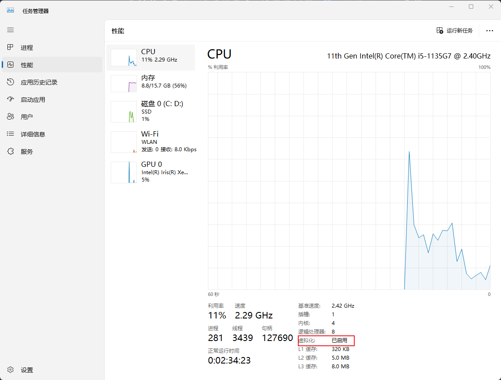

##### 2.2 系统设置(必须)

以下说明按照windows专业版说明

> - 勾选 `Hyper-v`
>
> 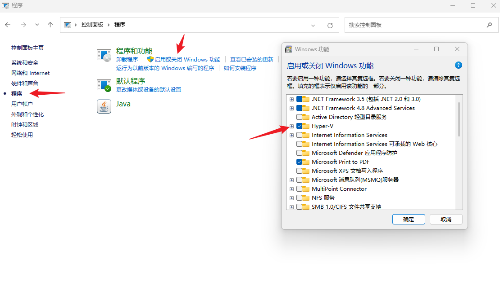
>
> - 勾选 `适用于Linux的Windows子系统`
>
> 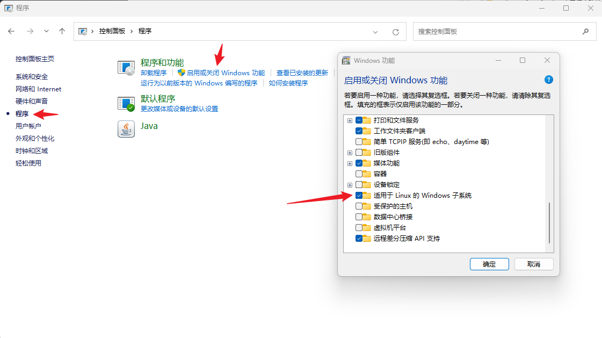
>
> - 打开 `Hyper-v` (管理员运行powershell)
>
> ```powershell
> bcdedit /set hypervisorlaunchtype auto #特别说明, 如果需要关闭, 则输入  bcdedit /set hypervisorlaunchtype off
> ```

#### 3.系统安装

##### 3.1 升级wsl内核

> - [官方文档地址](https://learn.microsoft.com/en-us/windows/wsl/install-manual#step-4---download-the-linux-kernel-update-package) 其实就以下两步(官网还包括系统安装之类, 也可以看我这个后续步骤)
>   - 下载wsl2安装包 [官方下载地址](https://wslstorestorage.blob.core.windows.net/wslblob/wsl_update_x64.msi)
>   - 设置WSL 默认版本  `wsl --set-default-version 2`

##### 3.2 安装linux系统

> **有"命令安装" 和 "微软商店安装" 两种安装方式, 二选其一**

###### 3.2.1 命令安装

> ```powershell
> # 可用的 发行版名称 可以用命令 wsl -l -o 或者 wsl --list --online 来查看, 例如 Ubuntu
> wsl --install -d <发行版名称>
> ```

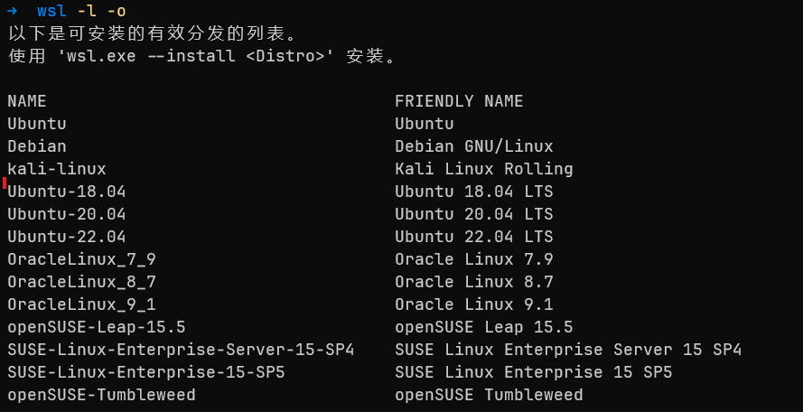

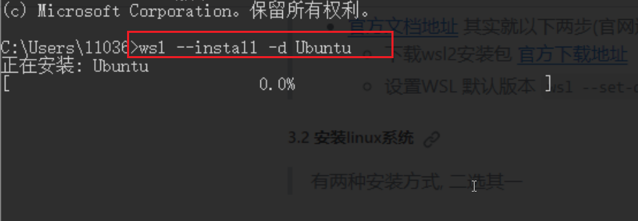

###### 3.2.2 微软商店安装

> 你喜欢哪个下哪个, 例如 Ubuntu
>
> 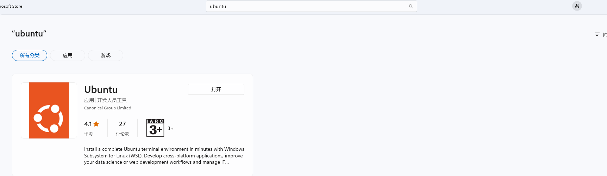

###### 3.2.3 安装好以后, *打开子系统*,按照提示设置用户名及密码

#### 4. 终端安装(可选)

> 推荐装一个终端软件
>
> 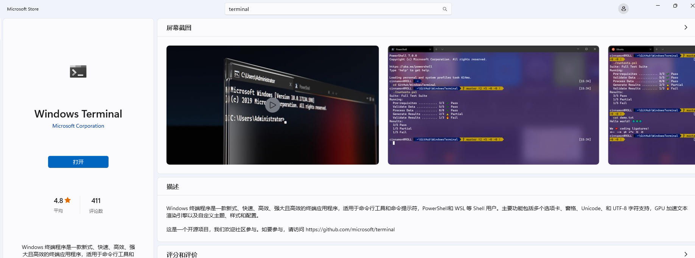

#### 5. 存储迁移(可选)

> - wsl默认保存在C:\Users\<主机名>\AppData\Local下, 如果需要迁移存储位置, 可按照以下方式进行处理
>   ```powershell
>   #1.查看wsl安装哪些分支
>   wsl -l -v
>   #2.关闭所有的分支及wsl2
>   wsl --shutdown
>   #3.导出相关分支
>   wsl --export Ubuntu D:\fileSave\wsl\temp\ubuntu.tar
>   #4.注销分发并删除根文件系统。
>   wsl --unregister Ubuntu
>   #5.将指定的 tar 文件作为新分发导入
>   wsl --import Ubuntu D:\fileSave\wsl\wsl2 D:\fileSave\wsl\temp\ubuntu.tar
>   #6.查看。执行1的操作即可。
>   ```
>
> (特备说明: 以上步骤也可以用来迁移docker存储位置, 详见[1.docker-desktop相关记录](../docker-desktop%E7%9B%B8%E5%85%B3%E8%AF%B4%E6%98%8E/1.docker-desktop%E7%9B%B8%E5%85%B3%E8%AE%B0%E5%BD%95.md))
>
> - 执行样例如下 `<br/>`
>   
>   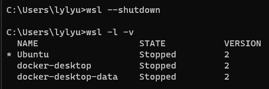
>   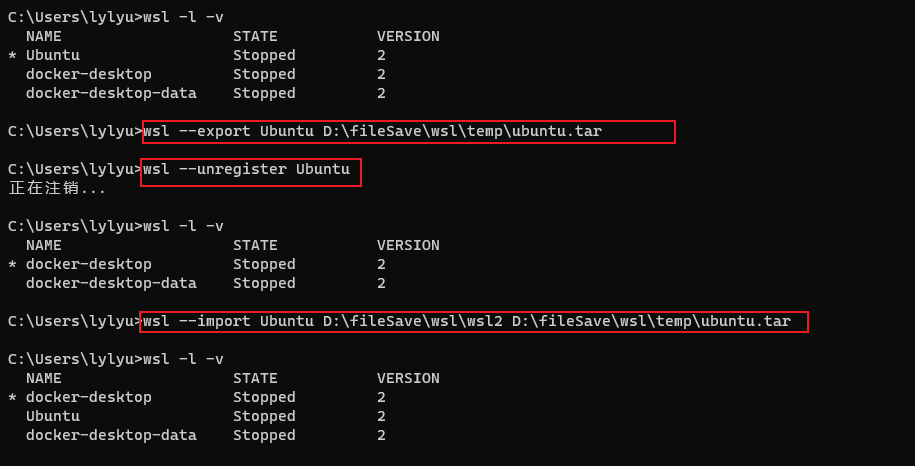

#### 6. 终端美化

> 详见[wsl美化](../windows-terminal/5.wsl%E7%BE%8E%E5%8C%96.md)

#### 7 在 Windows 文件资源管理器中查看当前目录

> 可使用以下命令从命令行打开 Windows 文件资源管理器，以查看存储文件的目录：
>
> ```bash
> explorer.exe .
> ```
>
> 另外，还可以使用 powershell.exe /c start . 命令。请确保在命令的末尾添加句点以打开当前目录。

> 如果在 Windows 文件资源管理器中查看所有可用的 Linux 发行版及其根文件系统，请在地址栏中输入：`\\wsl$`

#### **. 可能遇到的问题

##### **.1 Ubuntu启动报错

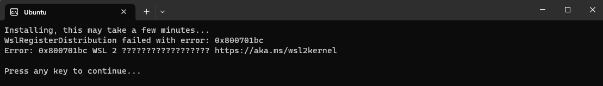

解决办法, 升级wsl内核, 见 `3.1`

##### **.2 安装Ubuntu时提示系统找不到指定的文件。

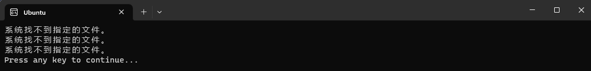

解决办法:

> ```powershell
> ##1. 查询当前已安装的系统
> wsl.exe --list --all
>
> ##2. 注销当前注册的系统  
> wsl.exe --unregister Ubuntu20.04LTS ##第一步查询出来需要注销的系统名称
>
> ##3. 重启Ubuntu, 系统就会初始化
> ```
>
> 操作截图如下
>
> 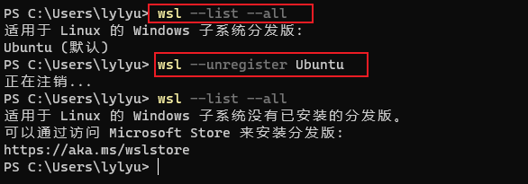
>
> 

##### **.3 参考的对象类型不支持尝试的操作

> 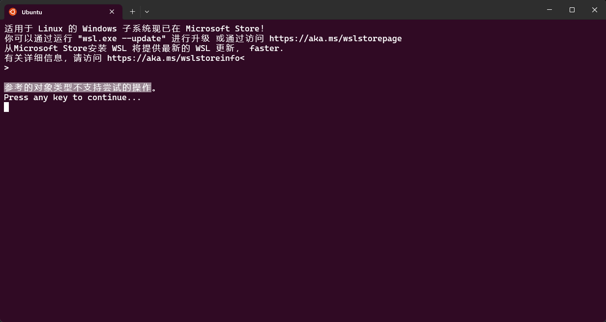
>
> 解决办法, 管理员打开cmd, 输入 `netsh winsock reset`, 然后重启子系统即可

##### **.4 wsl未释放已删除目录

> 问题描述:
>
> 在windows资源管理器中删除 `D:\dir\subdir\subdir2`, 然后再wsl中会发现 `/mnt/d/dir/subdir/subdir2`并没有释放(访问不到但提示目录存在), 这个时候你如果 `mkdir /mnt/d/dir/subdir/subdir2` 或 `rm -rf /mnt/d/dir/subdir/subdir2` 都失败
>
> 解决办法:
>
> 目前我使用的是重启wsl(如果你有其他办法, 可以告诉我), 具体命令如下(详细见 [0.常用命令](#0常用命令))
>
> ```powershell
> #1.停止LxssManager服务, 需管理员运行
> net stop LxssManager  
>  
> #2. 启动LxssManager服务, 需管理员运行
> net start LxssManager 
>
> #3. 启动wsl
> wsl
> ```

##### **.5 切换发行版使用的wsl版本

> 前置描述: 有可能某些发型是用wsl1安装的, 这个时候就需要我们切换一下发行版版本了
>
> A. 查看发行版, `wsl -l -v` 或则 `wsl --list --verbose`, 如下所示
>
> 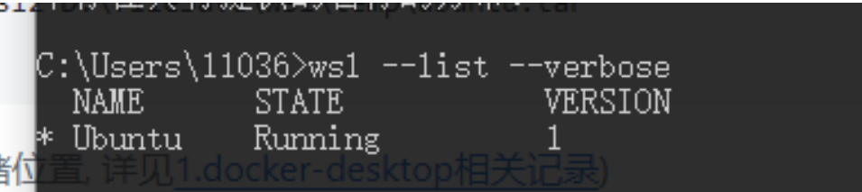
>
> B. 切换版本(需要先安装wsl2), `wsl.exe --set-version [发行版名称] 2`, 发行版名称有步骤A中所示, 例如 `wsl.exe --set-version Ubuntu 2`
>
> 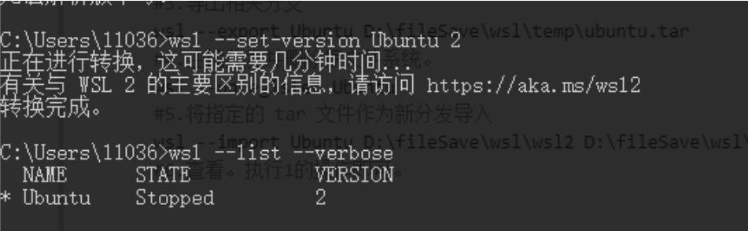

#### 0.常用命令

[wsl命令官方说明](https://learn.microsoft.com/zh-cn/windows/wsl/basic-commands)

##### 0.1 查看可同时在线安装的 Linux 发行版名称

```powershell
wsl -l -o
# 或者
wsl --list --online
```

##### 0.2 安装wsl2

```powershell
wsl --install # 此选项必需，以下选项按需选择

    # --no-distribution # 不安装发行版
    # --distribution <发行版名称> # 同时安装指定发行版, 发行版名称可以从 0.1 种查看
    # --no-launch # 安装发行版但安装完时不自动启动
```

##### 0.3 列出已安装的发行版及其详细信息

```powershell
wsl -l -v
# 或着
wsl --list --verbose

# 其他选项, (搭配-l或--list使用)
#   --all 列出已安装的发行版, 不包含详细信息
#   --running 列出当前正在运行的发行版
#   --quiet 仅显示发行版名称
```

##### 0.4 设置默认启动的发行版

```powershell
wsl -s <发行版名称>
# 或着
wsl --set-default <发行版名称>

# <发行版名称> 可以从0.3中去查看
```

##### 0.5 运行指定发行版

```powershell
wsl -d <发行版名称>
# 或
wsl --distribution <发行版名称>

# <发行版名称> 可以从0.3中去查看
```

##### 0.6 更新wsl

```powershell
wsl --update # 必需，默认从 Microsoft Store 下载更新

# 其他选项, 例如 wsl --update --web-download
    # --web-download # 从 GitHub 下载更新
```

##### 0.7 查看wsl版本/状态

```powershell
# 查看wsl状态
wsl --status

#查看wsl版本
wsl --version
```

##### 0.8 关闭wsl及linux发行版

```powershell
# 关闭 WSL 且会终止正在运行的 Linux
wsl --shutdown

# 仅终止正在运行的 Linux，不会关闭 WSL, <发行版名称>可以从0.3中查看
wsl --terminate <发行版名称>
```

##### 0.9 导入导出发行版

```powershell
# 导出发行版, 例如 wsl --export Ubuntu D:\fileSave\wsl\temp\ubuntu.tar
wsl --export <发行版名称> <绝对\路径\文件名.tar>
# 导入发行版, 例如 wsl --import Ubuntu D:\fileSave\wsl\wsl2 D:\fileSave\wsl\temp\ubuntu.tar
wsl --import <发行版名称> <导入后\存放\绝对路径\目录> <要导入的\绝对\路径\文件名.tar>
```

##### 0.10 卸载发行版

```powershell
# 卸载发行版会删除发行版所有数据, 例如 wsl --unregister Ubuntu
wsl --unregister <发行版名称>
```

##### 0. 11 设置wsl版本(默认版本, 发行版使用的wsl版本)

```powershell
# 设置WSL 默认版本, 在运行下面这个命令以后再安装的linux发行版会默认使用wsl2
wsl --set-default-version 2

# 如果需要单独设置发行版使用其他的wsl版本, 可以使用如下命令
wsl --set-version <发行版名称> 2
```

##### 0. 12 LxssManager服务(可用来重启wsl)

```powershell
# 停止LxssManager服务, 管理员运行
net stop LxssManager
# 启动LxssManager服务, 管理员运行
net start LxssManager


### 一个重启wsl的样例步骤如下 (当然你也可以重启电脑或使用其他办法)
#1.停止LxssManager服务, 需管理员运行
net stop LxssManager  

#2. 启动LxssManager服务, 需管理员运行
net start LxssManager 

#3. 启动wsl
wsl

```

##### 0.13 Hyper-v 打开/关闭

```powershell
# 查看 `hypervisorlaunchtype`状态, 输出状态会有以下几种
# Auto: 这表示Hyper-V已启用，并且将在需要时自动启动。
# Off: 这表示Hyper-V已禁用，并不会自动启动。
# On: 这表示Hyper-V已启用，并且会在系统启动时自动启动。
bcdedit /enum\| find "hypervisorlaunchtype"

# 打开 `Hyper-v`, 管理员运行
bcdedit /set hypervisorlaunchtype auto

# 关闭 `Hyper-v, 管理员运行`
bcdedit /set hypervisorlaunchtype off
```
